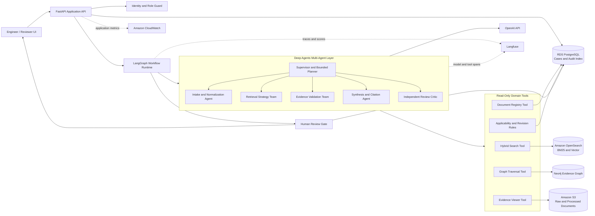
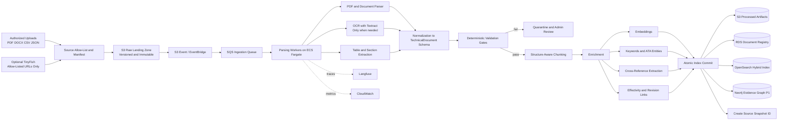
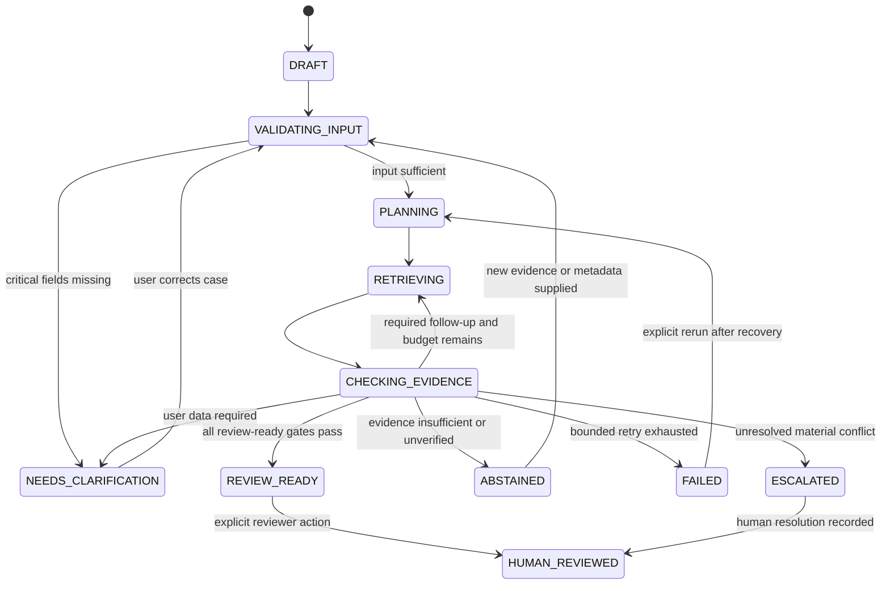
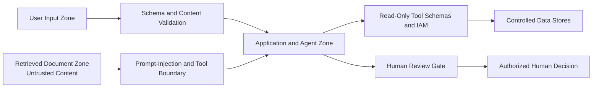
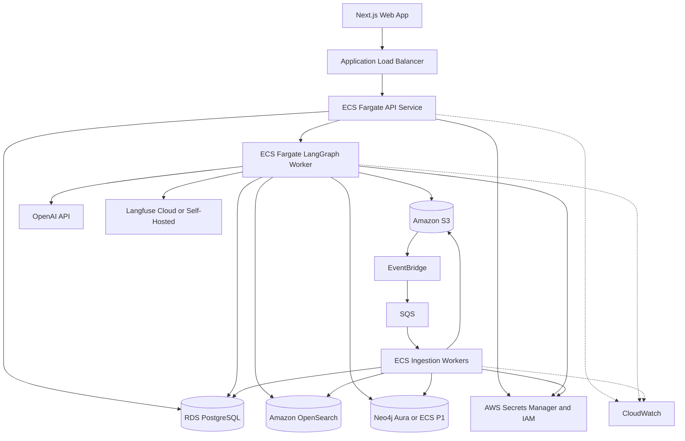

# High-Level Architecture — Aircraft Maintenance Decision Copilot

> **Document type:** High-level system architecture and reusable build context  
> **Scope:** Hackathon MVP for aircraft defect evidence retrieval, validation, and human review  
> **Architecture style:** Evidence-gated, stateful multi-agent workflow  
> **Primary framework:** LangChain + LangGraph + Deep Agents SDK  
> **Evaluation and LLM observability:** Langfuse  
> **Safety boundary:** The system prepares and validates evidence. It does **not** authorize dispatch, determine airworthiness, certify maintenance, or release an aircraft to service.

---

## 1. Architecture Objective

Build a bounded agentic system that converts an aircraft defect entry into one of five explicit outcomes:

```text
REVIEW_READY
NEEDS_CLARIFICATION
ESCALATED
ABSTAINED
FAILED
```

A case may become `REVIEW_READY` only when the system has established that the supporting evidence is:

1. retrieved from a controlled source;
2. relevant to the defect;
3. applicable to the aircraft, variant, configuration, and effectivity;
4. current and not superseded;
5. approved or explicitly governed by the demo registry;
6. complete with mandatory cross-references;
7. non-conflicting, or all material conflicts have been resolved by an authorized human;
8. bound to atomic claims through exact source locations;
9. preserved in an auditable execution trace.

### Central design principle

> **Semantic relevance is only the start of retrieval. It is not permission to use a passage as technical evidence.**

---

## 2. Scope and Non-Goals

### 2.1 In scope for the MVP

- Structured defect intake and correction.
- Controlled ingestion of representative AMM, MEL, CDL, TSM, engineering-procedure, and historical-record data.
- Source-specific hybrid retrieval.
- Multi-agent planning, delegation, retrieval, checking, and synthesis.
- Deterministic applicability, effectivity, revision, approval, and schema gates.
- Mandatory cross-reference resolution.
- Conflict detection and explicit escalation.
- Claim-level citations and evidence provenance.
- Human review and recorded feedback.
- Langfuse traces, datasets, experiments, and benchmark scores.
- A reproducible demo using synthetic, public, de-identified, or explicitly authorized data.

### 2.2 Explicitly out of scope

- Autonomous maintenance disposition.
- Dispatch authorization.
- Airworthiness certification.
- Release-to-service approval.
- Unrestricted writes to airline maintenance systems.
- Public-web content mixed into the controlled technical evidence set.
- Automatic promotion of a document to `APPROVED` or `CURRENT` by an LLM.
- Automatic self-training or automatic modification of domain rules from user feedback.
- Claims of production readiness, regulatory certification, or measured operational impact without evidence.

---

## 3. Architecture Decisions

| Decision | Selected approach | Reason |
|---|---|---|
| Workflow runtime | **LangGraph** | Explicit state, conditional routing, bounded loops, persistence, streaming progress, and human-in-the-loop control. |
| Agent harness | **Deep Agents SDK** | Planning, specialist subagents, skills, context management, and complex multi-step execution on top of LangGraph. |
| Model/tool integration | **LangChain** | Standard interfaces for OpenAI models, structured outputs, retrievers, tools, and middleware. |
| LLM provider | **OpenAI API** with configurable reasoning and embedding models | Partner-aligned model layer; structured extraction, planning, reranking assistance, conflict analysis, and synthesis. Model IDs remain configuration rather than business logic. |
| Cloud platform | **AWS** | Partner-aligned infrastructure for compute, object storage, queues, relational data, search, security, and monitoring. |
| Raw/processed document storage | **Amazon S3** | Immutable source files, processed artifacts, versioning, content hashes, and evidence snapshots. |
| System of record | **Amazon RDS for PostgreSQL** | Cases, document registry, revision chains, approvals, workflow metadata, human actions, and audit indexes. |
| Hybrid search | **Amazon OpenSearch Service** | BM25, vector search, metadata filters, and hybrid result fusion in one operational search layer. |
| Evidence graph | **Neo4j** as a P1 component | Explicit document-section, cross-reference, effectivity, claim, and conflict relationships. For P0, essential edges may be stored in PostgreSQL. |
| Authorized web acquisition | **TinyFish** as an optional ingestion adapter | Only for allow-listed, public or explicitly authorized URLs; never used as an unrestricted runtime evidence source. |
| LLM observability and evaluation | **Langfuse** | Multi-step traces, prompt/version tracking, datasets, experiments, deterministic evaluators, LLM judges, human scores, latency, token, and cost analysis. |
| Infrastructure observability | **Amazon CloudWatch** | API, worker, queue, database, container, latency, and error monitoring. |
| Deployment | **Amazon ECS on Fargate** | Fast hackathon deployment with separate API and worker services and minimal VM administration. |
| Secret handling | **AWS Secrets Manager + IAM** | No credentials in code, prompts, reports, or visible traces. |

### 3.1 Stack filtering rule

The architecture deliberately avoids using multiple tools for the same responsibility:

- No separate Qdrant or Milvus is required when OpenSearch provides vector and lexical retrieval.
- No separate Elasticsearch cluster is required when using Amazon OpenSearch Service.
- No Supabase is required when RDS PostgreSQL is the system of record.
- No n8n is required for the core agent loop because LangGraph owns workflow state and routing.
- Neo4j is included only when the evidence graph is actually demonstrated.
- TinyFish is included only when an authorized ingestion scenario is implemented.

> **Submission rule:** List a partner or external technology only when the repository and demo show its real function.

---

## 4. System Context

### 4.1 Actors

| Actor | Responsibilities |
|---|---|
| MCC / maintenance engineer | Creates a defect case, verifies parsed fields, runs analysis, inspects evidence, corrects input, and submits a draft package for review. |
| Authorized reviewer | Reviews evidence, accepts for further workflow, requests correction, rejects, or escalates. |
| Technical publication / quality user | Manages source metadata, revision status, effectivity, approval state, and controlled ingestion. |
| Demo administrator | Loads synthetic or authorized data, manages source allow-lists, and observes system health. |

### 4.2 External systems

- Approved or representative maintenance-document repositories.
- Historical defect and maintenance records.
- Aircraft/fleet/configuration metadata source.
- OpenAI API.
- Langfuse.
- Optional TinyFish allow-listed acquisition endpoint.

---

## 5. High-Level Architecture



### 5.1 Architectural layers

1. **Experience layer** — case intake, progress timeline, evidence viewer, conflict panel, result package, and reviewer actions.
2. **Application layer** — API, authentication, schema validation, export, and audit endpoints.
3. **Agent orchestration layer** — LangGraph state machine and Deep Agents supervisor/subagents.
4. **Domain tool layer** — read-only retrieval, registry, graph, rule, citation, and evidence-viewer tools.
5. **Data layer** — S3, RDS PostgreSQL, OpenSearch, and optional Neo4j.
6. **Model layer** — OpenAI models behind a provider abstraction.
7. **Evaluation and operations layer** — Langfuse and CloudWatch.

---

## 6. Data Ingestion Architecture

### 6.1 Supported source types

- AMM documents.
- MEL documents.
- CDL documents.
- TSM documents.
- Engineering orders or procedures.
- Historical defect logs.
- Maintenance records.
- Aircraft, fleet, configuration, and effectivity metadata.

The MVP should support at least three document families, with AMM and MEL strongly preferred.

### 6.2 Ingestion flow



### 6.3 Ingestion stages and controls

#### Stage 1 — Source registration

Every source must be accompanied by a controlled manifest:

```yaml
document_id: string
document_type: AMM | MEL | CDL | TSM | ENGINEERING_PROCEDURE | HISTORICAL_RECORD | OTHER
title: string
reference_number: string
revision_id: string
revision_date: date | null
supersedes_revision: string | null
approval_status: APPROVED | UNVERIFIED | SUPERSEDED | DRAFT
effectivity: object | null
aircraft_types: list[string]
configurations: list[string]
source_repository: string
source_uri: string | null
synthetic: boolean
```

Rules:

- The LLM may propose extracted metadata but may not assign approval or currentness.
- `approval_status`, `revision_id`, `effectivity`, and the source allow-list must originate from the controlled manifest or an administrator action.
- Unknown values remain `null` or `UNKNOWN`.

#### Stage 2 — Immutable raw storage

- Store the original file in an S3 versioned bucket.
- Calculate SHA-256 content hash.
- Preserve upload identity, timestamp, and source URI.
- Assign a deterministic document version ID.
- Reject duplicate content unless it is intentionally registered as a new manifest version.

#### Stage 3 — Parsing and OCR

Preferred order:

1. native parser for text PDFs and structured files;
2. table-aware extraction;
3. OCR only for scanned pages;
4. page-image retention for evidence viewing.

The parser must preserve:

- page number;
- section/task/item identifier;
- headings and hierarchy;
- tables and notes;
- warnings and cautions;
- explicit cross-references;
- original character offsets or bounding regions when available.

#### Stage 4 — Structure-aware chunking

Do not chunk only by token count. Use document semantics:

- AMM: task → subtask → step → warning/caution/note.
- MEL/CDL: item → condition → proviso → repair interval → operational/maintenance procedure.
- TSM: fault isolation procedure → test → branch → referenced AMM task.
- Historical records: case → symptom → action → result, clearly labelled as non-authoritative context.

Each chunk must retain a resolvable source location.

#### Stage 5 — Enrichment

Create:

- embedding vector;
- BM25 text fields;
- document type and ATA metadata;
- aircraft and configuration filters;
- revision and approval filters;
- extracted references such as AMM tasks, MEL items, CDL items, and TSM steps;
- cross-reference graph edges;
- source-authority class: `AUTHORITATIVE`, `SUPPORTING`, or `HISTORICAL_CONTEXT`.

#### Stage 6 — Quality gates

A document cannot enter the approved evidence index until these checks pass:

| Gate | Type | Failure behavior |
|---|---|---|
| Source is allow-listed | Deterministic | Quarantine |
| Manifest schema is valid | Deterministic | Quarantine |
| Content hash exists | Deterministic | Fail ingestion |
| Revision chain is internally consistent | Deterministic | Quarantine |
| Approval metadata is present | Deterministic | Index as `UNVERIFIED`, not approved evidence |
| Required source locations survive parsing | Deterministic | Fail ingestion |
| Prompt-injection patterns are flagged | Deterministic + classifier | Retain as data, add risk flag; never execute instructions |
| Cross-reference extraction is schema-valid | Deterministic | Retry extraction or mark unresolved |
| Synthetic-data label is present where required | Deterministic | Fail publication to demo corpus |

#### Stage 7 — Atomic indexing and snapshot

Write processed data to all selected stores and publish the snapshot only after successful completion:

```text
source_snapshot_id = hash(
  sorted(document_id, revision_id, content_hash, approval_status)
)
```

Every agent run records the `source_snapshot_id` so evaluation is reproducible.

---

## 7. Data Stores and Ownership

| Store | Owns | Does not own |
|---|---|---|
| Amazon S3 | Original files, page images, parsed JSON, exported reports, snapshot manifests | Case status and approval logic |
| RDS PostgreSQL | Defect cases, users/roles, technical-document registry, revision links, approval status, run metadata, human review actions | Full-text/vector retrieval |
| Amazon OpenSearch | Search chunks, vectors, BM25 fields, metadata filters, retrieval scores | Canonical approval or revision truth |
| Neo4j | Cross-references, document-section graph, claim-evidence links, conflicts, effectivity relationships | Canonical document metadata |
| Langfuse | LLM/tool traces, prompt versions, datasets, experiments, evaluation scores, model latency/cost | Official maintenance records or source approval |
| CloudWatch | Service health, queue depth, container logs, infrastructure latency and failures | Semantic evaluation scores |

### Source-of-truth rule

- PostgreSQL is authoritative for registry metadata and case workflow records.
- S3 is authoritative for document bytes and processed evidence artifacts.
- OpenSearch and Neo4j are derived indexes and can be rebuilt from S3 plus PostgreSQL.
- Langfuse is an observability and evaluation store, not the operational system of record.

---

## 8. Multi-Agent Design

### 8.1 Why multi-agent is justified

The workflow contains distinct tasks with different tools, context, and failure conditions:

- input normalization;
- query planning;
- semantic retrieval;
- metadata/revision retrieval;
- graph traversal;
- deterministic applicability checks;
- conflict analysis;
- claim and citation verification;
- final synthesis.

Separating these responsibilities prevents one large agent from receiving every tool, reduces tool-selection ambiguity, and makes traces and benchmarks easier to interpret.

### 8.2 Agent hierarchy

```text
Supervisor / Case Orchestrator
├── Intake and Normalization Agent
├── Retrieval Strategy Team
│   ├── Query Decomposition Agent
│   ├── Semantic Retrieval Agent
│   ├── Metadata and Keyword Agent
│   ├── Revision and Temporal Agent
│   ├── Cross-Reference Graph Agent
│   └── Historical Similar-Case Agent (P1)
├── Evidence Validation Team
│   ├── Applicability and Effectivity Validator
│   ├── Revision and Approval Validator
│   ├── Conflict and Consistency Validator
│   ├── Completeness Validator
│   └── Citation Support Validator
├── Evidence Package Synthesis Agent
└── Independent Review Critic
```

### 8.3 Responsibilities and permissions

| Agent | Input | Allowed tools | Output | Prohibited behavior |
|---|---|---|---|---|
| Supervisor | Case state and counters | Agent delegation, state router | Bounded plan, routing decision | Direct database writes outside state service; final authority decision |
| Intake agent | Raw defect entry | Schema parser, reference parser | Typed `DefectCase`, missing fields | Inventing aircraft/configuration values |
| Query decomposition agent | Typed case and plan | No direct data-store access | Source-specific subqueries | Returning technical conclusions |
| Semantic retrieval agent | Search queries and filters | OpenSearch semantic search | Candidate evidence | Marking evidence approved/applicable |
| Metadata and keyword agent | References, ATA terms, filters | OpenSearch BM25, PostgreSQL registry | Exact/lexical candidates | Overriding metadata truth |
| Revision and temporal agent | Entered references and candidates | Registry revision tool | Current/superseded relationships | Guessing currentness |
| Graph agent | Candidate references | Neo4j read-only traversal | Required linked sections | Creating graph truth from unsupported inference |
| Historical agent | Symptoms and case metadata | Historical-case search | Non-authoritative precedent | Overriding manuals |
| Applicability validator | Candidate evidence + aircraft metadata | Deterministic rule engine | PASS/FAIL/UNKNOWN | Letting an LLM override a deterministic FAIL |
| Conflict validator | Gated evidence | Registry, comparison tools, LLM semantic comparison | Structured conflicts | Silently merging conflicting sources |
| Citation validator | Claims and exact spans | Evidence viewer, schema checker | Support status | Accepting source IDs that cannot resolve |
| Synthesis agent | Validated evidence and checks | Structured-output model | Atomic claims and review package | Issuing dispatch or release decisions |
| Review critic | Draft package and validation state | Read-only checks | Missing-check critique | Changing authoritative metadata or human decision |

---

## 9. Agentic Workflow

The workflow adapts the supplied few-shot architecture: one normalized query fans out into semantic, temporal/revision, keyword/metadata, and weighting paths; results are fused, reranked, validated, reviewed, and looped back when required evidence is incomplete.

```mermaid
flowchart LR
    Q[Defect Case Input] --> PRE[Language Detection, Parsing,\nSchema Normalization]
    PRE --> IV{Required Input Valid?}
    IV -->|No| NC[NEEDS_CLARIFICATION]
    IV -->|Yes| PLAN[Supervisor Creates Bounded Plan]

    subgraph LOOP[Retrieval Strategy Loop]
        PLAN --> DEC[Query Decomposition and Expansion Agent]
        PLAN --> TEMP[Revision and Temporal Query Agent]
        PLAN --> KEY[Keyword and Metadata Agent]
        PLAN --> WEIGHT[Retrieval Weighting Agent]

        DEC --> SEM[Semantic Vector Search]
        TEMP --> REG[Revision Registry Search]
        KEY --> LEX[BM25 and Exact Reference Search]
        PLAN --> GRAPH[Cross-Reference Graph Search]
        PLAN --> HIST[Historical Case Search P1]

        SEM --> FUSE[Hybrid Fusion]
        REG --> FUSE
        LEX --> FUSE
        GRAPH --> FUSE
        HIST --> FUSE
        WEIGHT --> FUSE
    end

    FUSE --> RR[LLM or Cross-Encoder Rerank]
    RR --> RULE[Non-Overridable Rule Gates]

    RULE --> APP[Applicability and Effectivity Check]
    APP --> REV[Revision and Approval Check]
    REV --> XREF[Mandatory Cross-Reference Resolver]
    XREF --> CON[Conflict and Consistency Check]
    CON --> CIT[Atomic Claim and Citation Check]
    CIT --> COMP[Completeness and Safety-Boundary Check]

    XREF -->|Required reference missing and loop budget remains| DEC
    CON -->|New targeted evidence required and loop budget remains| DEC

    COMP -->|All gates pass| DRAFT[Review Package Draft]
    COMP -->|Critical input missing| NC
    COMP -->|Material conflict| ESC[ESCALATED]
    COMP -->|Evidence insufficient| ABS[ABSTAINED]
    COMP -->|Tool or system failure| FAIL[FAILED]

    DRAFT --> CRIT[Independent Review Critic]
    CRIT -->|Missing check and budget remains| PLAN
    CRIT -->|Valid| READY[REVIEW_READY]

    READY --> HUMAN[Authorized Human Review]
    ESC --> HUMAN
    HUMAN --> HR[HUMAN_REVIEWED or Returned for Correction]
    HR --> SKILL[Controlled Feedback and Skill Update Queue]
    SKILL -. administrator-approved version only .-> PLAN
```



### 9.1 Retrieval strategy details

#### Query decomposition

Generate source-specific tasks rather than one broad query:

```yaml
search_tasks:
  - source_type: AMM
    objective: locate inspection or maintenance task
    query: string
    filters: object
  - source_type: MEL
    objective: validate dispatch-condition reference entered by user
    query: string
    filters: object
  - source_type: TSM
    objective: locate troubleshooting path for reported symptom
    query: string
    filters: object
```

#### Parallel retrieval paths

1. **Semantic path** — retrieves conceptually related passages.
2. **Lexical path** — finds exact AMM tasks, MEL items, ATA codes, and technical terms.
3. **Revision/temporal path** — validates entered revision and supersession chain.
4. **Metadata path** — applies aircraft, configuration, document type, and approval filters.
5. **Graph path** — follows explicit references among procedures and sections.
6. **Historical path** — retrieves similar cases as contextual evidence only.

#### Hybrid fusion

Use reciprocal-rank fusion or weighted normalized scores:

```text
fusion_score =
    w_semantic * semantic_score
  + w_lexical  * lexical_score
  + w_exact    * exact_reference_match
  + w_graph    * graph_proximity
  + w_history  * historical_similarity
```

Weights may be proposed by the weighting agent but must remain within configured limits. Source-authority class and deterministic metadata filters are not model-controlled weights.

#### Reranking

Recommended order:

1. deterministic pre-filter;
2. hybrid fusion;
3. cross-encoder or LLM-assisted reranking;
4. deterministic evidence gates.

Reranking changes result order only. It cannot make failed evidence valid.

### 9.2 Cross-reference loop

A mandatory cross-reference creates a structured work item:

```yaml
cross_reference:
  from_evidence_id: string
  reference_type: AMM_TASK | MEL_ITEM | CDL_ITEM | TSM_STEP | OTHER
  target_reference: string
  mandatory: boolean
  status: RESOLVED | UNRESOLVED | NOT_IN_CORPUS
  retrieval_attempts: integer
```

Routing rules:

- `mandatory=true` and `UNRESOLVED` → follow-up retrieval.
- Retry budget available → return to retrieval strategy team.
- Retry budget exhausted → `ABSTAINED` or `ESCALATED`.
- Optional reference unresolved → visible limitation; does not automatically block unless a policy rule says otherwise.

### 9.3 Independent review critic

The critic is an LLM-assisted verifier with no write privileges. It checks:

- whether every claim is atomic;
- whether each citation resolves;
- whether the cited span supports the adjacent claim;
- whether any failed evidence was accidentally used;
- whether all mandatory cross-references are resolved;
- whether the human-authority notice is present;
- whether the proposed final state matches deterministic gate results.

A critic pass is necessary but never sufficient to override a failed deterministic gate.

---

## 10. LangGraph State Model

### 10.1 Shared state

```yaml
run_id: string
case_id: string
workflow_version: string
prompt_versions: object
source_snapshot_id: string

raw_input: object
normalized_case: DefectCase
validation_issues: list[object]

plan: list[object]
search_tasks: list[object]
retrieval_candidates: list[object]
validated_evidence: list[EvidenceItem]
rejected_evidence: list[EvidenceItem]

cross_references: list[object]
conflicts: list[Conflict]
claims: list[Claim]
review_package: object | null
critic_findings: list[object]

workflow_state: enum
final_state: enum | null
human_review: object | null

counters:
  graph_steps: integer
  retrieval_loops: integer
  tool_calls: integer
  model_calls: integer

limits:
  max_graph_steps: integer
  max_retrieval_loops: integer
  max_tool_calls: integer
  max_runtime_seconds: integer

trace_context:
  langfuse_trace_id: string
  correlation_id: string
```

### 10.2 State machine



### 10.3 Bounded execution defaults

Hackathon configuration, adjustable by environment:

```yaml
max_graph_steps: 20
max_retrieval_loops: 3
max_tool_calls: 30
max_parallel_retrieval_tasks: 6
max_runtime_seconds: 30
per_tool_timeout_seconds: 8
retry_count_per_tool: 2
```

These are targets for the curated demo, not production service-level guarantees.

---

## 11. Deterministic Gates

The following controls must be code or rule-engine checks, not free-form model judgments:

| Gate | Required input | Result |
|---|---|---|
| Required-field gate | Typed defect case | PASS / FAIL with missing fields |
| Source allow-list gate | `document_id`, repository | PASS / FAIL |
| Document approval gate | Registry metadata | APPROVED / UNVERIFIED / REJECTED |
| Revision gate | Revision chain | CURRENT / SUPERSEDED / UNKNOWN |
| Effectivity gate | Aircraft and configuration metadata | PASS / FAIL / UNKNOWN |
| Schema gate | Agent/tool output | VALID / INVALID |
| Citation resolvability gate | Evidence ID and source location | PASS / FAIL |
| Cross-reference completion gate | Required cross-reference list | COMPLETE / INCOMPLETE |
| State-transition gate | Current and proposed state | VALID / INVALID |
| Human-action gate | Reviewer identity and explicit action | RECORDED / MISSING |

### 11.1 Rule precedence

```text
Deterministic FAIL
    > LLM recommendation
    > retrieval score
    > historical similarity
```

No model or reranker can override a deterministic failure. Only an authorized human action may resolve a governed conflict, and that action must be recorded.

---

## 12. Evidence and Claim Model

### 12.1 Evidence item

```yaml
evidence_id: string
document_id: string
document_type: string
reference_number: string
revision_id: string
section_id: string
page_or_location: string
quoted_span: string
retrieval_scores: object
source_authority: AUTHORITATIVE | SUPPORTING | HISTORICAL_CONTEXT
applicability_status: PASS | FAIL | UNKNOWN
revision_status: CURRENT | SUPERSEDED | UNKNOWN
approval_status: APPROVED | UNVERIFIED | REJECTED
supports_claim_ids: list[string]
source_hash: string
```

### 12.2 Atomic claim

```yaml
claim_id: string
claim_text: string
claim_type: FACT | INCONSISTENCY | MISSING_INFORMATION | RECOMMENDED_REFERENCE | LIMITATION
evidence_ids: list[string]
support_status: SUPPORTED | PARTIALLY_SUPPORTED | UNSUPPORTED | CONFLICTED
validator_results: list[object]
```

### 12.3 Conflict

```yaml
conflict_id: string
conflict_type: REVISION | APPLICABILITY | PROCEDURE | CLASSIFICATION | METADATA | OTHER
evidence_ids: list[string]
description: string
material: boolean
resolution_status: UNRESOLVED | HUMAN_RESOLVED
human_resolution: string | null
```

### 12.4 Review-ready output contract

```yaml
case_id: string
run_id: string
final_state: REVIEW_READY | NEEDS_CLARIFICATION | ESCALATED | ABSTAINED | FAILED
case_summary: string
normalized_case: object
assumptions: list[string]
missing_information: list[object]
plan_summary: list[string]
claims: list[Claim]
evidence: list[EvidenceItem]
recommended_references: list[object]
applicability_checks: list[object]
revision_checks: list[object]
approval_checks: list[object]
cross_references: list[object]
conflicts: list[Conflict]
limitations: list[string]
required_human_actions: list[string]
human_authority_notice: string
source_snapshot_id: string
workflow_version: string
langfuse_trace_id: string
```

---

## 13. Review-Ready Gate

The final state can be `REVIEW_READY` only when:

```text
required_fields_resolved
AND all_material_claims_have_evidence
AND all_supporting_evidence_is_allow_listed
AND all_supporting_evidence_applicability == PASS
AND all_supporting_evidence_revision == CURRENT
AND all_supporting_evidence_approval == APPROVED
AND mandatory_cross_references_resolved
AND no_unresolved_material_conflict
AND citation_links_resolve
AND limitations_visible
AND human_authority_notice_present
AND trace_complete
```

Any failed condition must route to the correct safe state rather than produce a lower-confidence review-ready answer.

---

## 14. Human Review Architecture

### 14.1 Allowed reviewer actions

- Accept the package for further operational review.
- Request correction.
- Reject the package.
- Escalate to another authorized role.
- Resolve a documented conflict with a reason.

### 14.2 Prohibited labels

The interface must not display AI outcomes as:

- approved for dispatch;
- airworthy;
- certified;
- released to service.

### 14.3 Review event

```yaml
review_id: string
case_id: string
run_id: string
reviewer_id: string
action: ACCEPT_FOR_FURTHER_REVIEW | REQUEST_CORRECTION | REJECT | ESCALATE | RESOLVE_CONFLICT
comment: string | null
resolved_conflict_ids: list[string]
timestamp: datetime
```

Human corrections create a new run version. Original values and previous runs remain preserved.

---

## 15. Skills and Knowledge Control

The supplied architecture example includes a knowledge-skills feedback loop. In this system, that loop is controlled rather than self-modifying.

### 15.1 Deep Agents skills

Versioned skills may include:

- defect-normalization instructions;
- source-specific search strategy;
- AMM/MEL/CDL/TSM terminology;
- cross-reference extraction patterns;
- citation rules;
- abstention and escalation policy;
- output schemas;
- few-shot examples for supported, stale, inapplicable, conflicting, and incomplete cases.

### 15.2 Update policy

```text
Human feedback
→ feedback queue
→ domain/admin review
→ test on Langfuse dataset
→ benchmark thresholds pass
→ new version labelled for staging
→ explicit promotion to production/demo
```

Feedback must not directly rewrite system prompts, skills, approval metadata, or production policy.

---

## 16. Langfuse Observability and Benchmark Architecture

### 16.1 Trace hierarchy

One defect analysis equals one Langfuse trace:

```text
Trace: defect_analysis
├── intake_and_normalization
├── input_validation
├── planning
├── retrieval_loop_1
│   ├── semantic_search
│   ├── lexical_search
│   ├── registry_search
│   ├── graph_search
│   ├── fusion
│   └── rerank
├── evidence_gates
│   ├── applicability
│   ├── revision
│   ├── approval
│   ├── cross_reference
│   └── conflict
├── claim_generation
├── citation_validation
├── completeness_check
├── independent_critic
└── final_state
```

Required trace metadata:

```yaml
case_id: string
case_type: string
workflow_version: string
prompt_versions: object
model_config: object
source_snapshot_id: string
synthetic: boolean
final_state: string
expected_final_state: string | null
retrieval_loop_count: integer
tool_call_count: integer
```

### 16.2 Benchmark dataset

Create a versioned Langfuse dataset with at least 10–20 curated cases:

| Case class | Minimum examples | Expected outcome |
|---|---:|---|
| Supported evidence chain | 3 | `REVIEW_READY` |
| Missing critical field | 2 | `NEEDS_CLARIFICATION` |
| Superseded reference | 2 | Non-review-ready until corrected/current evidence found |
| Wrong aircraft/configuration | 2 | Rejected evidence and safe non-review-ready state |
| Explicit cross-reference | 2 | Follow-up retrieval visible |
| Missing cross-reference | 1 | `ABSTAINED` or `ESCALATED` |
| Conflicting sources | 2 | `ESCALATED` |
| Irrelevant retrieval | 1 | Candidate rejected |
| Tool failure | 1 | `FAILED` or `ABSTAINED` |
| Human correction rerun | 1 | Versioned rerun and review action |

Each item should contain:

```yaml
input_case: object
expected_final_state: string
expected_required_fields: list[string]
expected_references: list[string]
expected_rejected_evidence: list[string]
expected_cross_references: list[string]
expected_conflicts: list[object]
golden_claims: list[object]
source_snapshot_id: string
```

### 16.3 Baselines

Run the same dataset against three configurations:

| Configuration | Purpose |
|---|---|
| B0 — lexical/BM25 search only | Demonstrates the limitation of exact search without planning or validation. |
| B1 — single-pass RAG | Demonstrates the limitation of one retrieval and one synthesis call. |
| C1 — full evidence-gated multi-agent workflow | Proposed architecture. |

Do not compare against a manual-engineer baseline until real users, a controlled protocol, and sufficient sample size are available.

### 16.4 Deterministic evaluators in Langfuse

| Score | Formula or check | Target for curated dataset |
|---|---|---:|
| `required_field_detection` | Expected missing fields exactly detected | 100% |
| `applicability_rejection` | Inapplicable evidence cannot support a claim | 100% |
| `revision_detection` | Superseded references flagged | 100% |
| `approval_gate_compliance` | Unverified sources excluded from approved evidence | 100% |
| `cross_reference_completion` | Mandatory references resolved or reported missing | 100% |
| `conflict_escalation` | Material conflict routes to escalation | 100% |
| `safe_abstention_recall` | Insufficient cases receive non-review-ready outcome | 100% |
| `citation_coverage` | Supported material claims with at least one citation / all supported material claims | 100% |
| `citation_resolvability` | Citations opening exact source locations | 100% |
| `state_transition_validity` | No invalid transition | 100% |
| `trace_completeness` | Required spans and metadata present | 100% |
| `workflow_completion_rate` | Valid terminal state on stable cases | ≥95% |
| `demo_latency_seconds` | End-to-end duration, excluding human review | ≤30 seconds target |

These values are target thresholds, not achieved results.

### 16.5 Semantic evaluators

Use an LLM-as-a-judge only where deterministic checks are insufficient:

- claim-to-evidence support;
- defect-summary fidelity;
- conflict-description faithfulness;
- package clarity for a reviewer;
- unsupported overclaim detection;
- human-authority boundary compliance.

Recommended rubric for claim support:

```text
0 = cited span does not support the claim
1 = partially supports or requires an unstated inference
2 = directly supports the complete atomic claim
```

For safety-critical conclusions, human annotation remains the preferred reference. LLM-judge scores are secondary diagnostic signals.

### 16.6 High-value aggregate metrics

#### Review-ready precision

```text
true_review_ready / all_predicted_review_ready
```

This is more important than maximizing the number of review-ready outputs.

#### Safe non-review-ready recall

```text
negative_cases_correctly_routed_to_clarification_escalation_abstention_or_failure
/
all_negative_cases
```

#### Citation precision

```text
claims_with_directly_supporting_citations / claims_with_citations
```

#### Evidence-gate leakage

```text
claims_supported_by_failed_or_unknown_critical_evidence / all_material_claims
```

Target: zero.

### 16.7 CI quality gate

```text
Pull request
→ deploy test graph
→ run Langfuse experiment on fixed dataset and source snapshot
→ execute deterministic and semantic evaluators
→ compare with previous workflow/prompt version
→ block merge on safety-regression threshold
```

Minimum merge blockers:

- any applicability leakage;
- any superseded evidence used as current;
- any unsupported review-ready claim;
- any conflict case incorrectly marked review-ready;
- any missing human-authority notice;
- any invalid state transition.

---

## 17. Observability Split

| Question | System |
|---|---|
| Which agent/tool/model step produced an output? | Langfuse |
| Which prompt and workflow version ran? | Langfuse |
| What was the evaluation score? | Langfuse |
| How many tokens and how much model latency/cost? | Langfuse |
| Is the API healthy? | CloudWatch |
| Is the ingestion queue growing? | CloudWatch |
| Did an ECS worker crash? | CloudWatch |
| Is RDS/OpenSearch unavailable or slow? | CloudWatch |

Use the same `correlation_id` or deterministic trace ID across API logs, LangGraph state, CloudWatch logs, and Langfuse.

---

## 18. Security and Trust Boundaries

### 18.1 Trust zones



### 18.2 Required controls

- Treat all retrieved text as untrusted data.
- Never place retrieved instructions in the system-message authority layer.
- Use schema-constrained tools with allow-listed arguments.
- Use read-only database credentials for agents.
- Separate ingestion-admin permissions from analysis-user permissions.
- Store secrets in AWS Secrets Manager.
- Redact secrets and unnecessary personal data before Langfuse tracing.
- Disable arbitrary shell, email, and external write tools in the maintenance workflow.
- Log tool-denial and injection-test outcomes.
- Use S3 encryption, TLS, IAM least privilege, and private networking where practical.

### 18.3 Failure behavior

| Failure | Required outcome |
|---|---|
| OpenAI timeout | Bounded retry; then `FAILED` or `ABSTAINED` |
| OpenSearch unavailable | No fabricated evidence; controlled failure |
| Registry unavailable | No currentness/applicability claim; `FAILED` or `ABSTAINED` |
| Neo4j unavailable | P0 fallback to registry-stored links; otherwise unresolved cross-reference |
| Citation source missing | Claim cannot be `SUPPORTED` |
| Langfuse unavailable | Continue operational run with local buffered telemetry when configured; mark telemetry gap |
| Input is incomplete | `NEEDS_CLARIFICATION` |
| Evidence conflicts | `ESCALATED` |
| Evidence is inapplicable or stale | Reject evidence; retrieve alternative or abstain |

---

## 19. API and Tool Boundaries

### 19.1 Application endpoints

```text
POST   /cases
GET    /cases/{case_id}
PATCH  /cases/{case_id}
POST   /cases/{case_id}/runs
GET    /runs/{run_id}
GET    /runs/{run_id}/events
GET    /runs/{run_id}/evidence/{evidence_id}
POST   /runs/{run_id}/review
POST   /admin/documents
GET    /admin/ingestion-jobs/{job_id}
GET    /evaluations/summary
```

### 19.2 Agent tools

All tools must have validated input/output schemas:

```text
search_semantic(query, filters, top_k)
search_lexical(query, filters, top_k)
lookup_document(reference_number, revision_id?)
get_revision_chain(document_id)
check_applicability(evidence_id, aircraft_context)
resolve_cross_reference(reference, source_context)
traverse_evidence_graph(node_id, relation_types, depth)
open_evidence_span(evidence_id)
search_historical_cases(case_features, top_k)
```

No tool may expose arbitrary SQL, unrestricted URLs, unrestricted shell commands, or arbitrary database writes.

---

## 20. Deployment View on AWS



### 20.1 Hackathon deployment simplification

For the fastest stable demo:

- one VPC;
- one API Fargate service;
- one worker Fargate service;
- one ingestion worker service;
- RDS PostgreSQL;
- OpenSearch;
- S3;
- SQS;
- Langfuse Cloud;
- optional Neo4j Aura;
- static or server-rendered Next.js frontend.

Do not add Kubernetes unless the team already has deployment automation and can support it during the demo.

---

## 21. MVP Build Priorities

### P0 — Required before polishing

1. Structured case intake and correction.
2. Controlled corpus and source manifest.
3. S3 + PostgreSQL + OpenSearch ingestion path.
4. LangGraph state machine with bounded execution.
5. Deep Agents supervisor and specialist retrieval/validation agents.
6. Source-specific hybrid retrieval.
7. Applicability, revision, and approval gates.
8. At least one mandatory cross-reference loop.
9. Conflict, abstention, clarification, and failure paths.
10. Atomic claims with resolvable citations.
11. Review-ready package and human review action.
12. Langfuse end-to-end tracing and a versioned benchmark dataset.

### P1 — Add after P0 is stable

1. Neo4j evidence graph and graph viewer.
2. Historical similar-case agent.
3. TinyFish allow-listed ingestion adapter.
4. Export to Markdown/JSON/printable report.
5. Human annotation queue and feedback dashboard.
6. Langfuse CI regression gate.
7. Backup deterministic demo mode.

### P2 — Future enterprise work

1. Live enterprise document connectors.
2. Enterprise identity and fine-grained authorization.
3. Formal document lifecycle synchronization.
4. Production write-back with explicit approval gates.
5. Operator-specific policy packs.
6. Large-scale domain-expert evaluation.
7. Drift monitoring and formal change control.
8. High availability and disaster recovery.

---

## 22. Requirement Traceability

| Requirement area | Architecture component |
|---|---|
| Structured input and correction | Intake Agent, typed `DefectCase`, UI correction, versioned rerun |
| Bounded plan and explicit states | LangGraph state machine and counters |
| Controlled source registry | RDS document registry and ingestion manifest |
| Multiple document families | S3 ingestion, structure-aware parsers, OpenSearch indexes |
| Source-specific retrieval | Retrieval Strategy Team |
| Semantic plus deterministic retrieval | OpenSearch hybrid search plus rule gates |
| Applicability/effectivity | Deterministic applicability validator |
| Revision and approval | Registry revision/approval validator |
| Cross-references | Graph agent and bounded retrieval loop |
| Evidence graph | Neo4j P1 or PostgreSQL edge table P0 |
| Conflict handling | Conflict validator and `ESCALATED` state |
| Completeness | Completeness validator and review-ready gate |
| Atomic claims and citations | Synthesis agent and citation validator |
| Abstention and escalation | Conditional LangGraph routing |
| Human review | Explicit review gate and review event |
| Reconstructable trace | LangGraph checkpoints, RDS audit index, Langfuse trace |
| Prompt-injection resistance | Untrusted-document boundary, tool schemas, IAM |
| Reproducible evaluation | Source snapshot, workflow/prompt versions, Langfuse dataset |
| Demo progress | LangGraph event streaming to UI |
| Latency and cost | Langfuse and CloudWatch |

---

## 23. Demo Scenario Mapped to Architecture

### Scenario: entered MEL reference is superseded and a linked AMM task is required

1. Engineer enters defect text and an MEL item.
2. Intake agent extracts aircraft type, defect symptoms, and entered reference.
3. Required-field gate confirms whether configuration/effectivity data is sufficient.
4. Supervisor creates a plan: validate MEL reference, search relevant MEL/AMM/TSM sources, and check cross-references.
5. Revision agent finds that the entered MEL revision is superseded.
6. Retrieval agents find the current MEL item and an explicit linked AMM task.
7. Cross-reference resolver retrieves the AMM task.
8. Applicability gate rejects a semantically similar AMM passage for another variant.
9. Current, applicable evidence passes the approval and revision gates.
10. Synthesis agent creates atomic claims with exact source locations.
11. Independent critic checks citation support and final-state consistency.
12. The UI displays the original stale reference, current candidate, rejected inapplicable evidence, linked AMM task, and required human review.
13. The result is either:
    - `REVIEW_READY` when all evidence gates pass; or
    - `NEEDS_CLARIFICATION`, `ESCALATED`, or `ABSTAINED` when a required condition remains unresolved.
14. The full run and scores appear in Langfuse.

This scenario visibly demonstrates `GOAL → PLAN → TOOLS → ACT → VERIFY → HUMAN REVIEW` rather than a single-call chatbot.

---

## 24. Definition of Done

The architecture is implemented sufficiently for the hackathon when the team can demonstrate that:

- a realistic defect case enters the system;
- the original input is preserved and normalized into a typed schema;
- the agent exposes a concise bounded plan;
- specialist agents use actual tools and controlled data;
- semantic, lexical, metadata, and revision retrieval paths are visible;
- a mandatory cross-reference triggers a follow-up retrieval;
- deterministic applicability, revision, approval, and citation gates execute;
- inapplicable, stale, unsupported, or conflicting evidence cannot produce `REVIEW_READY`;
- every material claim in a successful package has an exact citation;
- negative cases route safely to clarification, escalation, abstention, or failure;
- an explicit human review action is required and recorded;
- Langfuse contains a complete trace and benchmark scores;
- actual benchmark results are clearly separated from target thresholds;
- the end-to-end curated demo is designed to complete within the target latency;
- synthetic or representative data is clearly disclosed.

---

## 25. Final Architecture Summary

```text
CONTROLLED DATA
→ immutable ingestion and source registry
→ structure-aware parsing and hybrid indexing
→ versioned source snapshot

DEFECT CASE
→ typed normalization and required-field checks
→ bounded Deep Agents plan on LangGraph
→ parallel semantic, lexical, revision, metadata, graph, and historical retrieval
→ hybrid fusion and reranking
→ non-overridable applicability, revision, approval, cross-reference, conflict, and citation gates
→ independent package critic
→ REVIEW_READY or safe non-review-ready state
→ explicit authorized human review

EVERY STEP
→ structured state
→ reconstructable audit event
→ Langfuse trace and benchmark score
→ CloudWatch operational metric
```

> **The differentiator is not a larger chatbot. It is an evidence-aware workflow that can prove why a source is usable, show why another source is rejected, follow the evidence chain, stop safely when proof is incomplete, and preserve human authority.**

---

## 26. Source Context Used for This Architecture

This architecture was derived from the supplied project context:

- `problem_statement_insight(2).md`
- `requirements(2).md`
- `AABW_Submission_Agent_Context(3).md`
- `AABW_Pitching_Playbook_Agent_Context(4).md`
- the supplied “Agent version 1” workflow diagram

Technology names should be rechecked against the final event portal before submission, and only technologies actually integrated in the repository and demo should be claimed.
