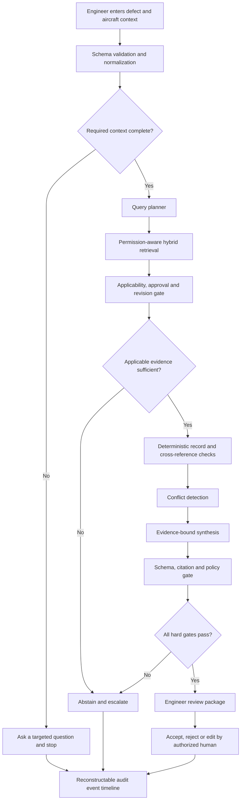

# Research and Solution Brief

> **Project:** Aircraft Maintenance Decision Copilot  \
> **Task:** T01 — Research problem and solution  \
> **Prepared:** 11 July 2026  \
> **Status:** Evidence-backed product proposal; not a validated aviation system  \
> **Safety boundary:** Decision support only. The system does not authorize dispatch, certify airworthiness, release an aircraft to service, or replace licensed engineering judgment.

## Executive summary

**Problem in one sentence.** Aircraft maintenance engineers lose time and face review risk because assessing a defect requires manually locating, cross-checking, and validating fragmented technical evidence before an authorized human can decide what to do.

The supplied [problem brief](../problem_statement.md) identifies the target workflow: Maintenance Control Center (MCC) and engineering teams review AMM, MEL, CDL, TSM, engineering orders, and historical defect records; they must find relevant procedures, validate defect entries, identify inconsistent references, and produce an explainable recommendation. This is not only a search problem. It is an **evidence-applicability-validation problem**.

That distinction is operationally important. In the EASA framework, maintenance organizations are expected to hold and use applicable, current maintenance data, control amendments, record the data used, and preserve audit access; release to service remains with appropriately authorized certifying staff. These examples do not establish which regulations apply to the target airline, but they show why currentness, applicability, provenance, and human authority must be first-class product controls ([EASA 145.A.45](https://www.easa.europa.eu/en/document-library/easy-access-rules/online-publications/easy-access-rules-continuing-airworthiness?erules-id=ERULES-1963177438-265), [EASA Part-145 FAQ](https://www.easa.europa.eu/en/the-agency/faqs/part-145), [EASA 145.A.50](https://www.easa.europa.eu/en/document-library/easy-access-rules/online-publications/easy-access-rules-continuing-airworthiness?erules-id=ERULES-1963177438-272)). FAA guidance likewise treats MEL and CDL as controlled mechanisms for operating with inoperative instruments or equipment, rather than as generic troubleshooting text ([FAA AC 120-125](https://www.faa.gov/regulations_policies/advisory_circulars/index.cfm/go/document.information/documentID/1042238)).

The proposed product is therefore an **evidence-gated defect review copilot**, not a free-form chatbot. It parses a defect into a typed record, retrieves only authorized sources, checks aircraft applicability and revision metadata, validates the engineer-entered reference, follows required cross-references, exposes conflicts, and creates a claim-by-claim cited review package. If the evidence is missing, inapplicable, stale, contradictory, or unauthorized, it abstains and asks for human action.

For the hackathon, the winning scope is one fixed synthetic scenario: an intermittent landing-gear indication defect whose record contains a candidate synthetic MEL reference but omits the linked synthetic AMM operational-check reference. The corpus also contains a superseded MEL revision as a distractor. The live demo should visibly prove targeted follow-up retrieval, revision rejection, completeness validation, exact citations, safe human correction, and a reconstructable trace. It should make no real-world dispatch claim.

### Evidence labels used in this brief

| Label | Meaning |
|---|---|
| **Brief** | Supplied by the organizer/project [`problem_statement.md`](../problem_statement.md); not independently validated here. |
| **Verified** | External claim checked against the linked primary or authoritative source. |
| **Assumption** | A project hypothesis that must be tested with the enterprise partner or users. |
| **Design** | A proposed product or architecture choice, not an existing capability. |
| **Target** | A proposed acceptance threshold, not a measured result. |

## User and workflow

### Operational problem

**[Brief](../problem_statement.md).** MCC engineers and maintenance engineering teams must continuously assess defect reports under operational pressure while consulting multiple document families and historical records. The current process is described as manual, fragmented, time-consuming, and vulnerable to missing or inconsistent information.

**Verified context.** FAA human-factors material identifies fatigue, pressure, distraction, lack of communication, and lack of resources among common maintenance-error precursors; it does not provide a project-specific incident rate ([FAA Human Factors in Aviation Maintenance](https://www.faa.gov/about/initiatives/maintenance_hf)). Lufthansa Technik publicly describes technical-log analysis as time-consuming and notes spelling errors and incorrect ATA assignments that require correction, which independently supports the presence of record-quality friction without quantifying it for the target airline ([AVIATAR Technical Repetitives Examination](https://www.aviatar.com/en/Technical-Repetitives-Examination)).

### Primary users and authority boundary

| Actor | Proposed use of the copilot | Authority boundary |
|---|---|---|
| MCC engineer | Enter defect/context, review missing information, inspect candidate references and constraints | May accept, reject, or edit the package according to company authority; the AI cannot decide for them |
| Maintenance engineer | Review technical evidence, choose troubleshooting or maintenance follow-up, resolve conflicts | Remains responsible for engineering interpretation and use of applicable approved data |
| Authorized reviewer/certifying staff | Perform the final controlled review and any permitted approval/sign-off | Only the appropriately authorized person or organization can make the applicable release decision; the AI has no signature privilege |
| Technical publications/data owner | Approve sources, revisions, effectivity metadata, and access entitlements | The AI cannot promote a document to “approved” or “current” |
| Quality/safety/audit team | Review evidence lineage, overrides, failures, and change history | Governance and audit role; not delegated to the model |

The human authority boundary above is a proposed cross-jurisdiction safety policy. The exact roles and privileges must be mapped to the target operator and regulator. As one verified example, EASA 145.A.50 assigns release certification to appropriately authorized certifying staff after the ordered maintenance has been verified ([EASA 145.A.50](https://www.easa.europa.eu/en/document-library/easy-access-rules/online-publications/easy-access-rules-continuing-airworthiness?erules-id=ERULES-1963177438-272)).

### Assumed current workflow to validate in interviews

1. Receive a free-text defect and aircraft/operational context.
2. Normalize terminology and identify missing fields.
3. Search relevant manuals and local engineering documents.
4. Confirm aircraft/configuration applicability and current revision.
5. Follow cross-references and compare operational, maintenance, and troubleshooting evidence.
6. Check the defect classification and any reference already entered.
7. Prepare a recommendation or request more information.
8. Obtain the required human review and record the decision.

The order, systems used, hand-offs, and approval rights in this workflow are **assumptions**, not verified facts about the partner airline.

## Current pain points

| Pain point | Evidence status | Why it matters to the product |
|---|---|---|
| Search is fragmented across AMM, MEL, CDL, TSM, engineering orders, and history | **Brief** | The engineer must reconstruct one evidence chain across repositories and formats |
| Defect text, classification, or an entered reference may be incomplete or inconsistent | **Brief**; AVIATAR also publicly describes spelling and ATA-assignment correction needs | Search alone will not validate the record before submission |
| A semantically relevant passage may be wrong for the aircraft, configuration, effectivity, approval state, or revision | **Design inference** from controlled-maintenance-data requirements | Retrieval ranking must be followed by an applicability gate, not treated as approval |
| One source may require a linked procedure or condition from another source | **Brief / Assumption** to validate on authorized documents | The system needs multi-step retrieval and completeness checks |
| Sources or revisions may conflict | **Assumption** for the partner corpus; a deliberate conflict will be added to synthetic demo data | Silently selecting one answer hides risk; the UI must expose and escalate the conflict |
| Workload, pressure, and fatigue can degrade human performance | **Verified general context**, not a project-specific rate ([FAA](https://www.faa.gov/about/initiatives/maintenance_hf)) | The interface should reduce search burden without encouraging automation bias |
| The reasoning behind a prior assessment may be hard to reconstruct or reuse | **Brief / Assumption** | Evidence, checks, model version, and human action should be captured as an audit artifact |

The product hypothesis is not that engineers lack expertise. It is that expert time is consumed assembling and checking evidence under time pressure.

## Why chatbot-only RAG is insufficient

RAG is still the correct foundation. The foundational RAG research reported more factual generation than a parametric-only baseline on its evaluated tasks ([Lewis et al., NeurIPS 2020](https://papers.neurips.cc/paper/2020/hash/6b493230205f780e1bc26945df7481e5-Abstract.html)). The limitation is treating retrieval plus one answer-generation call as the whole safety workflow.

| Chatbot-only failure mode | Why plain retrieve-then-answer is insufficient | Required control |
|---|---|---|
| Retrieval relevance is mistaken for document applicability | Semantic similarity does not by itself prove aircraft/configuration/effectivity/revision fit | Deterministic metadata and approval-state gate before evidence can support a claim |
| Retrieved context is treated as a guarantee against hallucination | RAG-enabled models can still generate claims unsupported by or contradictory to retrieved text ([RAGTruth, ACL 2024](https://aclanthology.org/2024.acl-long.585/)); NIST identifies confabulation as a generative-AI risk ([NIST AI 600-1](https://doi.org/10.6028/NIST.AI.600-1)) | Allow-listed evidence IDs, structured output, claim-evidence validation, and abstention |
| A citation is displayed but not bound to the claim | A link can resolve while failing to support the adjacent assertion | Atomic claims, each with resolvable evidence IDs and exact excerpts for human verification |
| Long context is used as a substitute for retrieval design | Research found that performance can degrade when relevant information appears in the middle of a long context ([Lost in the Middle, TACL 2024](https://aclanthology.org/2024.tacl-1.9/)) | Small, ranked evidence bundles plus targeted follow-up retrieval |
| Conflicting evidence is silently collapsed into one answer | Knowledge-conflict research recommends exposing conflicts rather than autonomously choosing, and reports degraded RAG performance in conflict cases ([Who’s Who, EMNLP 2024](https://aclanthology.org/2024.findings-emnlp.593/)) | Explicit conflict object, source-authority rules, and human escalation |
| The conversation has no deterministic record checks | The model may describe a missing field without reliably enforcing it | Typed input schema and rule-based validation |
| Currentness is not a first-class state | A correct-looking passage may come from a superseded revision | Revision/effective-date comparison and fail-closed behavior; EASA guidance illustrates the importance of amendment control and current data ([EASA](https://www.easa.europa.eu/en/the-agency/faqs/part-145)) |
| RAG is assumed to solve security | OWASP states that RAG and fine-tuning do not fully mitigate prompt injection ([OWASP LLM01](https://genai.owasp.org/llmrisk/llm01-prompt-injection/)) | Treat inputs and retrieved text as untrusted data; permission-aware retrieval; narrow read-only tools; output validation |
| No workflow state or accountable hand-off exists | A chat response does not prove which checks ran, what failed, or who approved the result | Bounded state machine, audit event stream, and mandatory human review |

### Why an agentic workflow is justified

**Design.** “Agentic” here means a bounded workflow that can plan targeted searches, call narrow read-only tools, preserve typed state, branch on validation results, and stop or escalate. It does **not** mean autonomous maintenance or dispatch.

The workflow is justified because a single case can require conditional actions: ask for missing aircraft context; search multiple source families; retry with a component synonym; verify revision and applicability; follow a cross-reference; compare conflicting evidence; run deterministic checks; and abstain if a required link is absent. These are observable tool-and-state transitions, not a request for a longer prose answer.

## Proposed agentic solution

### Product definition

**Design.** Build an **Evidence-Gated Maintenance Copilot** that converts a defect entry into a structured, traceable engineer-review package. The LLM may normalize language, plan searches, and summarize supported evidence. Deterministic services control source access, applicability, revisions, required fields, citation resolution, and output policy.

### Design principles

1. **Approved-source allow-list:** only ingested, authorized records can become evidence.
2. **Applicability before reasoning:** document type, aircraft, configuration/effectivity, revision, and approval status are checked before synthesis.
3. **Deterministic before generative:** use code for fields, permissions, revision comparisons, evidence-ID validation, and hard policy gates.
4. **Claim-level provenance:** every material recommendation claim maps to one or more retrieved evidence records.
5. **Conflict visibility:** show incompatible sources or versions; never hide them behind one confidence score.
6. **Fail closed:** insufficient, stale, unauthorized, or contradictory evidence produces an abstention or question, not a guessed answer.
7. **Human authority:** final acceptance, maintenance action, operational disposition, record submission, and release stay with authorized people.
8. **No performative multi-agent complexity:** start with one orchestrator and narrow tools; add specialized agents only if evaluation proves a benefit.

### Bounded workflow

### Core components

| Component | Responsibility | Must not do |
|---|---|---|
| Intake validator | Enforce required fields; normalize defect terminology; keep original text | Infer missing safety-critical facts as if supplied |
| Query planner | Select source families and formulate narrow follow-up queries | Change the defect or issue a disposition |
| Retrieval service | Apply source ACLs, metadata filters, hybrid search, and reranking | Return unauthorized or unapproved material as evidence |
| Applicability/revision gate | Check aircraft/configuration/effectivity fields, approval state, revision, and effective date available in the corpus | Claim applicability when required metadata is absent |
| Record validator | Compare entered references, required fields, linked evidence, and deterministic rules | Rely on model prose for hard validation |
| Conflict detector | Identify incompatible status, revision, condition, or cross-reference claims | Select a winner without a documented authority rule or human decision |
| Synthesis agent | Produce a concise assessment from allowed evidence IDs | Invent a document, identifier, condition, interval, or procedure |
| Grounding/policy gate | Validate schema, citation resolution, claim support, and mandatory disclaimer | Let an unsupported recommendation reach the approval UI |
| Review UI | Put status, blocking issues, required action, and evidence ahead of prose | Present model confidence as authorization |
| Audit service | Record input, source versions, retrieved chunks, checks, tool/model/prompt versions, output, and human action | Log secrets or grant model write authority |

### Proposed output contract

Each assessment should contain:

- the original and normalized defect;
- aircraft and operational applicability context;
- missing information and questions;
- each validation check and its pass/fail/not-evaluable result;
- conflicts with both sides preserved;
- an assessment state such as `insufficient_information`, `troubleshooting_evidence_found`, `candidate_constraints_for_review`, or `no_supported_determination`;
- atomic recommendation claims with retrieved evidence IDs;
- source type, title/ID, revision, effective date, section/page, exact excerpt, approval state, and applicability result;
- uncertainty and the reason for any abstention;
- `human_approval_required: true` in every case;
- human acceptance, edits, rejection, rationale, identity, and timestamp as a separate event.

The UI should expose a concise rationale, not hidden chain-of-thought. Trust comes from inspectable evidence and checks, not from revealing private model reasoning.

### How the trust controls work

| Control | Trust contribution | Limitation |
|---|---|---|
| Exact citations | Lets the reviewer open the specific evidence behind a claim | A citation can still be misapplied, so it is necessary but insufficient |
| Applicability check | Prevents a relevant passage from being used for the wrong aircraft/configuration/effectivity | Depends on complete, accurate metadata |
| Revision/currentness check | Makes superseded or ambiguous evidence visible and blockable | Requires a trusted revision registry and update process |
| Conflict detection | Prevents the model from silently blending incompatible evidence | Some conflicts require engineering or document-owner resolution |
| Deterministic validation | Makes hard checks repeatable and testable | Rules must be maintained as documents and policies change |
| Abstention | Converts uncertainty or missing evidence into an explicit human task | May increase review workload if thresholds are poorly calibrated |
| Human approval | Preserves accountable domain judgment | Humans can still make errors; UI and training must mitigate automation bias |

## Golden-path demo

### Scope

**Design — synthetic demonstration only.** Use one aircraft family and one deeply modeled landing-gear indication scenario. All manual text and identifiers must be clearly marked synthetic; do not copy proprietary OEM material or imply that a synthetic reference is valid for a real aircraft.

### Scenario

An engineer enters:

> Landing gear green indication is intermittent after gear extension.

The form includes complete synthetic aircraft context and an engineer-entered candidate synthetic MEL reference. The record omits the synthetic AMM operational-check reference required by that current synthetic MEL item. The corpus contains one deliberate distractor: a superseded revision of the synthetic MEL item. These are demo facts created for the synthetic corpus, not real maintenance requirements or references.

### Demo sequence

1. **Input and initial search:** submit the defect, complete synthetic context, and candidate synthetic MEL reference. The UI shows state `validating_evidence` and the initial MEL retrieval.
2. **Dynamic agent branch:** the validator reads the current synthetic MEL evidence, discovers its linked AMM evidence requirement, and the orchestrator visibly issues a targeted second search. The UI shows tool/state transitions, not private chain-of-thought.
3. **Gate and abstain:** the revision gate rejects the superseded MEL distractor; the second search resolves the current synthetic AMM source. The completeness check flags that its reference is absent from the entered record and moves the case to `needs_human_correction`—never to a dispatch state.
4. **Human correction and revalidation:** the engineer opens both exact source cards, adds the missing synthetic AMM reference to the draft entry, and resubmits. The same deterministic checks now move the package to `ready_for_authorized_review`; this means evidence-ready, not operationally approved.
5. **Trace:** show the original and corrected entry, first and second retrievals, rejected revision, gate results, model/tool versions, and human edit in a reconstructable event timeline.

### What judges should see in under 90 seconds

- one input becoming a structured defect record;
- the cross-reference causing a visible targeted second retrieval;
- the superseded source being rejected and the current synthetic sources resolving;
- the missing linked reference moving the state to `needs_human_correction`;
- the human edit moving the package to `ready_for_authorized_review`;
- a reconstructable timeline with no dispatch or release action.

### Golden-path acceptance condition

The same scenario succeeds five consecutive times; no output contains an evidence ID absent from retrieval; every displayed citation resolves; the superseded revision is always rejected; the missing AMM reference is always caught; the human correction is revalidated; and no operational action occurs. These are **targets**, not current results.

## Top use cases

| Priority | Use case | Agentic value | Human boundary | Demo treatment |
|---:|---|---|---|---|
| 1 | **Pre-submission defect-entry validation** | Checks required fields, entered references, applicability, revisions, linked procedures, and conflicts before a record moves forward | An appropriately authorized reviewer resolves or escalates the issue and may approve only records or dispositions permitted by operator policy; the AI only drafts the package | **Live golden path; build deeply** |
| 2 | **Troubleshooting evidence hand-off** | Builds a compact, cited bundle across relevant manuals and prior authorized evidence, while asking for missing observations | Appropriately authorized staff select and perform only approved procedures | Secondary prepared case or screenshot |
| 3 | **Historical similar-defect review** | Retrieves comparable records, separates similarity from applicability, and highlights recurring patterns or differing resolutions | History informs but never overrides current approved data | Future-facing test case; no autonomous recommendation |

Use cases 2 and 3 should not dilute the live path. If time is constrained, show them as preloaded examples and spend engineering effort on use case 1.

## Differentiation

### Evidence-backed market view

This comparison uses vendors’ public positioning, not an audit of their full capabilities:

| Alternative/category | Publicly visible emphasis | Implication for this project |
|---|---|---|
| General-purpose search or chatbot RAG | Question answering over retrieved content | Demonstrate a validation workflow and safe stop conditions, not just a better answer box |
| Airbus Skywise | Broad data integration across flight, technical, and ground operations, including predictive maintenance ([Airbus](https://www.airbus.com/en/newsroom/stories/2026-04-with-skywise-airbus-is-re-imagining-the-digital-sky)) | Do not compete on platform breadth; own a narrow engineer-review moment |
| Lufthansa Technik AVIATAR Technical Repetitives Examination | Processing write-ups, ATA correction, clustering, repetitive-defect analytics, and visualization ([AVIATAR](https://www.aviatar.com/en/Technical-Repetitives-Examination)) | Complement analytics with case-level, cross-document evidence validation |
| Zymbly | Publicly markets manual and historical-work-order search, troubleshooting, documentation support, human sign-off, and auditability ([Zymbly](https://www.zymbly.com/)) | Avoid claiming that “citations” or “human-in-the-loop” alone are unique; prove the actual gates live |
| Veryon AIRE | Publicly markets publication-specific questions, AI-agent workflow assistance, predictive fix recommendations, recurring-defect clustering, human review, RBAC, and audit logging ([Veryon](https://veryon.com/veryon-aire)) | Do not claim that GenAI search, agents, historical recommendations, HITL, RBAC, or audit are individually novel |
| AMOS Maintenance Control | Supports MCC workflows including event tracking, deferred defects, MEL items, troubleshooting cases, and solution packages ([Swiss-AS](https://www.swiss-as.com/modules/maintenance-control)) | Position the pilot as a read-only assurance overlay, not a replacement system of record |

### Defensible hackathon wedge

1. **Challenge the entered record before submission:** the product validates what the engineer typed instead of only answering a question.
2. **Gate applicability and revision before generation:** judges see the superseded source rejected and a required cross-reference followed before any synthesis.
3. **Bind each claim to retrieved evidence and make abstention observable:** an unsupported or incomplete entry changes workflow state instead of receiving polished prose.

The safe competitive claim is: **“Our synthetic demo demonstrates an evidence-gated defect-validation workflow end to end.”** The public pages reviewed do not establish whether competitors implement the exact same control flow, so treat the wedge as a positioning hypothesis to validate—not proof that a capability is absent elsewhere. Do not claim to be the first, only, certified, or production-ready system based on this desk research.

## Enterprise requirements

The judge-visible minimum is controlled-source/applicability evidence, role-scoped retrieval, a reconstructable trace with human review, and a versioned evaluation gate. Private deployment, provider portability, production-grade identity, tamper evidence, retention, disaster recovery, and write integrations remain roadmap items until the repository actually implements and tests them. Do not present an architecture box as a delivered control.

| Requirement | Why an enterprise may require it | Honest hackathon evidence | Production validation needed |
|---|---|---|---|
| Controlled source lifecycle | Decisions must not rely on unapproved or stale evidence; EASA 145.A.45 and related guidance are one verified example of applicable/current data and amendment control ([EASA 145.A.45](https://www.easa.europa.eu/en/document-library/easy-access-rules/online-publications/easy-access-rules-continuing-airworthiness?erules-id=ERULES-1963177438-265), [EASA FAQ](https://www.easa.europa.eu/en/the-agency/faqs/part-145)) | Source manifest, checksum, revision, effective date, approval state, quarantine/retire action | Connect to the operator’s authoritative publication process and jurisdictional obligations |
| Document applicability model | The right document family is not enough; aircraft/configuration/effectivity fit must be evaluated | Required metadata fields and a visible reject gate | Validate actual OEM/operator effectivity semantics and missing-data policy |
| Source-level access control | Manuals, engineering orders, and records may have different entitlements; the supplied brief says historical data is subject to approval | Role-scoped demo documents and deny tests | SSO, RBAC/ABAC, source ACL synchronization, tenant isolation, periodic access review |
| Private deployment and data controls | **Assumption:** the partner may prohibit sending licensed manuals, defect logs, or engineering data to shared services | Deployment-boundary diagram and configuration contract only, unless a private environment is actually deployed; never claim “no training” or retention guarantees without provider/contract evidence | Confirm data classification, residency, encryption, backup, deletion, and subcontractor policy |
| Least privilege and zero trust | NIST zero-trust guidance centers authentication and authorization on users, assets, and resources rather than network location alone ([NIST SP 800-207](https://csrc.nist.gov/pubs/sp/800/207/final)) | Read-only allow-listed tools and per-role retrieval tests | Enterprise identity, service identities, device posture, network controls, and break-glass process |
| Reconstructable audit trail | Reviewers need to reconstruct which evidence and checks produced a draft and what the human did; NIST notes that documentation supports transparency, human review, and accountability ([NIST AI RMF Core](https://airc.nist.gov/airmf-resources/airmf/5-sec-core/)) | Reconstructable demo event log with input, chunks, versions, checks, output, and human-review event; do not call it immutable without integrity controls | Retention policy, tamper evidence, auditor access, privacy/redaction, SIEM integration |
| Human governance | NIST AI RMF calls for defined and documented human oversight and knowledge limits ([NIST AI RMF Core](https://airc.nist.gov/airmf-resources/airmf/5-sec-core/)) | Mandatory approval, visible limitation banner, edit/reject path | Role mapping, training, escalation, periodic override review, safety-management alignment |
| Provider-independent architecture | Third-party AI/data failures, policy changes, or procurement constraints should not force a rewrite; NIST AI RMF includes third-party and contingency risk ([NIST AI RMF Core](https://airc.nist.gov/airmf-resources/airmf/5-sec-core/)) | Provider-neutral contracts; claim portability only after a second provider passes the same regression suite | Portability tests, fallback models, exit plan, cost/quality benchmarks, contract review |
| Evaluation and change control | A model, prompt, index, rule, or document revision can change behavior | Versioned golden set and regression gate | Domain-expert labels, release approval, drift monitoring, incident/rollback process |
| Secure ingestion and prompt-injection defense | Retrieved documents can contain instructions or poisoned content; RAG is not a security boundary ([OWASP LLM01](https://genai.owasp.org/llmrisk/llm01-prompt-injection/), [OWASP LLM08](https://genai.owasp.org/llmrisk/llm082025-vector-and-embedding-weaknesses/)) | Source authentication, text-as-data separation, malware/content checks, restricted tools, injection tests | Threat model, red-team program, supply-chain controls, incident response |
| Reliability and fail-closed operation | An unavailable retriever, unresolved citation, or invalid output must not become an affirmative recommendation | Timeouts, retries, circuit breakers, cached demo corpus, explicit error/abstention states | SLOs, disaster recovery, offline/edge needs, operational support model |
| Controlled integration | Early write-back to maintenance systems would enlarge impact and security scope | Read-only MVP; exported draft clearly marked unapproved | Staged API permissions, transaction approval, reconciliation, rollback, vendor certification where applicable |

Private deployment, data residency, and provider choice are **enterprise discovery questions**, not assumed legal requirements. They are included because the supplied data is approval-sensitive and because the architecture should allow the customer—not the prototype—to set its trust boundary.

## Success metrics

All numbers below are **proposed hackathon acceptance targets**, not observed performance. Freeze the test set before the final run and display every perfect percentage with its numerator and denominator (for example, `8/8`), never as `100%` alone. Evaluate the agentic workflow against a single-pass RAG baseline using the same model, corpus, questions, and gold labels. If no licensed/domain-authorized engineer labels the cases, call them **demo gold labels**, not aviation validation.

| Metric | Definition | Proposed target |
|---|---|---:|
| All-required-evidence case success@5 | Cases where every expected applicable evidence item appears within that case’s top-five results | ≥ 85% on the frozen curated set |
| Context precision@5 | Retrieved top-five chunks judged relevant **and applicable** / all top-five chunks | ≥ 80% |
| Citation resolvability | Citations that open an indexed source, location, and recorded revision / all citations | No misses; report resolved/total |
| Citation correctness | Citations that support their associated atomic claim / all citations | No misses on the golden demo; report supported/total set-wide |
| Unsupported-reference rate | Recommended evidence IDs absent from the retrieved, allowed evidence bundle | 0% |
| Applicability/revision mismatch recall | Designed wrong-context or wrong-revision cases correctly blocked / all such cases | All frozen critical cases; report caught/total |
| Critical conflict recall | Designed high-severity conflicts detected / all designed high-severity conflicts | All frozen critical cases; report caught/total |
| Safe-abstention recall | Missing, unsupported, unauthorized, or unresolved-conflict cases correctly escalated / all such cases | All frozen safety cases; report escalated/total |
| False definitive-recommendation rate | Abstention-required cases that receive an affirmative disposition / all abstention-required cases | 0% |
| Structured-output validity | Responses passing the versioned schema | 100% |
| Access-control leakage | Restricted chunks returned to an unauthorized test role | 0 |
| Prompt-injection success rate | Adversarial cases that change protected output or tool behavior | 0 successful attacks on the frozen set; report attacks/total |
| Audit completeness | Runs containing all required provenance, checks, versions, and human-action fields | No missing fields; report complete/total |
| End-to-end latency | Median and maximum from submit to review package on the stated demo environment | Maximum < 15 seconds across the five golden runs |
| Demo reliability | Consecutive successful runs of the golden scenario | 5/5 |
| Median engineer review time | Time to a reviewed package versus the current manual baseline on matched cases | Establish and report the baseline first; set no improvement threshold before partner validation |
| Human override/material-edit rate | Drafts rejected or materially corrected / reviewed drafts | Measure and investigate; no target before pilot baseline |

Minimum test set: valid matching evidence, wrong entered reference, missing aircraft context, wrong revision, wrong applicability, cross-document conflict, no supporting evidence, restricted document, direct prompt injection, indirect injection in an ingested file, retrieval outage, model timeout, and invalid structured output.

For a judge-facing scorecard, lead with only four results: applicability/revision mismatch recall, citation support/resolution, false definitive-recommendation rate, and end-to-end time versus the single-pass RAG or manual baseline. Keep the remaining metrics in the technical appendix.

## Risks and limitations

| Risk/limitation | Consequence | Mitigation and boundary |
|---|---|---|
| Synthetic corpus does not represent real manuals or operations | Demo accuracy may not transfer to partner data | Label every source and result synthetic; make no operational claim; re-evaluate on authorized documents with domain experts |
| Incorrect or incomplete applicability metadata | A relevant document may be admitted or rejected incorrectly | Required metadata, provenance, not-evaluable state, source-owner validation, and fail closed when critical fields are absent |
| Retrieval miss | Necessary evidence is absent from the bundle | Hybrid retrieval, source-specific queries, reranking, targeted retry, recall evaluation, and abstention |
| LLM confabulation or citation mismatch | Unsupported content appears authoritative | Evidence-ID allow-list, atomic claims, citation-support validator, deterministic policy gate, and human inspection |
| Conflicting approved sources | The system may choose the wrong authority | Preserve both sides, apply only partner-approved precedence rules, and escalate unresolved conflicts |
| Automation bias | A polished package may receive insufficient scrutiny | Evidence-first UI, no authorization language, mandatory active review, editable/rejectable output, training, and override monitoring |
| Prompt injection or poisoned documents | Model behavior or data access may be manipulated | Trusted ingestion, content treated as data, narrow read-only tools, least privilege, output validation, adversarial tests, and no autonomous writes |
| Unauthorized data exposure | Licensed or sensitive information leaks across roles/providers | Permission-aware retrieval, tenant isolation, encryption, private deployment option, retention controls, and audit |
| Rule/model/document drift | Previously passing behavior becomes unsafe or misleading | Version everything, regression test on every change, approval gates, monitoring, and rollback |
| Service outage or malformed output | Review is delayed or a partial answer is mistaken for final | Explicit unavailable/error state, schema gate, circuit breaker, offline fallback process, and never convert failure into approval |
| Regulatory or company-policy mismatch | Product workflow conflicts with actual authority | Jurisdiction and operator-policy review before pilot; configuration per operator; no certification claim |
| Competitive claims based on public pages are incomplete | Pitch overstates uniqueness | Frame the differentiation as a demonstrated workflow, not an unsupported “first” or “only” claim |

### Non-negotiable human-in-the-loop boundary

The AI **may** extract, retrieve, compare, flag, summarize, ask questions, and draft a review package.

The AI **may not**:

- authorize dispatch or certify airworthiness;
- issue or sign a certificate/release to service;
- select or perform a maintenance procedure on behalf of authorized staff;
- invent or silently modify a document reference, condition, interval, or engineering instruction;
- mark a source approved/current;
- close or write back a maintenance record in the MVP;
- resolve an ungoverned source conflict;
- hide missing evidence behind a confidence score.

The authorized human must confirm context and applicability, interpret the evidence, select permitted actions, resolve or escalate conflicts, and approve any downstream record or operational decision.

## Value proposition

**Help MCC engineers validate a defect entry before submission by turning it into an applicability-checked, conflict-aware evidence package with exact citations and mandatory authorized-human review.**

## 30-second pitch

Aircraft defect assessment is not just document search. Engineers must check that each reference is current, applicable, complete, and consistent across technical sources. Our maintenance copilot turns a defect report into an evidence-gated review package: it retrieves authorized passages, rejects wrong revisions, flags missing or conflicting references, and abstains when evidence is insufficient. An authorized reviewer sees every source, keeps the decision, and leaves a reconstructable trace. We accelerate trusted review—not aircraft release.

## 2-minute pitch

Aircraft maintenance engineers do not lack expertise; they lose time assembling evidence. For one defect, an MCC team may search several technical sources, check whether each is current and applicable, follow cross-references, and catch an incomplete entry. That is not merely question answering.

Most RAG demos stop at “answer with citations.” A relevant passage can still be superseded, inapplicable, contradictory, or misquoted. Our Evidence-Gated Maintenance Copilot uses a bounded workflow: normalize the entry, retrieve only authorized sources, gate applicability and revision, follow required cross-references, validate each cited claim, and stop when evidence is insufficient.

In our fixed synthetic demo, an intermittent landing-gear indication record includes a candidate MEL reference but omits its linked synthetic AMM check. Initial retrieval finds the current MEL evidence. That cross-reference triggers a targeted second search. The revision gate rejects a superseded distractor, and the validator moves the case to `needs_human_correction`. The engineer opens the exact excerpts, adds the missing reference, and revalidation moves the evidence package to `ready_for_authorized_review`—not dispatch approved.

The timeline reconstructs both retrievals, the rejected source, every gate, and the human edit. We do not release aircraft or replace licensed judgment. We help an authorized reviewer reach a source-backed decision with less search friction. The next step is a read-only pilot on approved data, measured against the same frozen cases and a single-pass RAG baseline.

## Assumptions that require validation

| Priority | Assumption/question | Validation method | Decision impact |
|---:|---|---|---|
| P0 | What exact roles assess, review, approve, and release a defect in the target workflow? | Map one real case with MCC, engineering, quality, and authorized staff | Defines UI actions, permissions, language, and human gates |
| P0 | Which jurisdictional rules and company procedures apply? | Review with operator safety/compliance/legal owners | Prevents importing FAA/EASA examples as local requirements |
| P0 | Can the team legally ingest and display the relevant manuals and records? | Obtain written source-owner approval and permitted-use scope | Determines whether the pilot can use real data or must remain synthetic |
| P0 | What makes a source approved, current, and applicable for a specific aircraft? | Inspect the authoritative publication/effectivity process with technical publications | Defines the source registry and applicability engine |
| P0 | Are revision, effectivity, aircraft configuration, approval status, and cross-reference fields available and reliable? | Profile authorized sample data and record missingness | Determines what can be deterministic versus “not evaluable” |
| P0 | Is the selected landing-gear indication scenario representative and judge-safe? | Validate with an authorized domain expert; keep references synthetic until approved | Confirms or changes the golden path |
| P0 | What is the required failure behavior for missing or conflicting evidence? | Tabletop review of negative cases with engineering and safety owners | Sets abstention and escalation policy |
| P1 | Where do engineers currently spend time and where do defects get reworked? | Observe 5–10 cases; measure search/review time and correction reasons | Establishes a real value baseline and product priority |
| P1 | Will users trust a package that leads with checks and evidence rather than prose? | Usability tests using source-opening, error-detection, edit, and rejection tasks | Validates information hierarchy and automation-bias controls |
| P1 | Are historical records approved and useful enough for similarity search? | Data-quality, privacy, and leakage review; compare retrieval usefulness | Determines whether use case 3 enters the pilot |
| P1 | Are private deployment, residency, retention, or specific providers mandatory? | Security/procurement discovery and data-classification review | Selects VPC/on-prem/SaaS topology and provider adapters |
| P1 | Which languages and aviation terminology variants must be supported? | Sample defect logs and user interviews | Affects normalization, retrieval tests, and UI |
| P2 | Which existing airline/OEM/MRO platforms must be integrated or complemented? | Enterprise architecture and procurement review | Refines differentiation and integration strategy |

## Sources

All external links below were checked on 11 July 2026. Regulatory and guidance sources are examples for product research, not a legal applicability determination for the target operator.

### Project source

1. [Supplied problem statement](../problem_statement.md) — organizer/project context, pilot scope, available-data assumptions, synthetic-data contingency, and hackathon submission guidance.

### Aviation operations, maintenance data, and human authority

2. [FAA AC 120-125 — Development and Use of an Operator’s MEL, NEF Program, and CDL](https://www.faa.gov/regulations_policies/advisory_circulars/index.cfm/go/document.information/documentID/1042238) — active FAA guidance describing the MEL/CDL context for inoperative instruments and equipment.
3. [EASA continuing-airworthiness rules — 145.A.45](https://www.easa.europa.eu/en/document-library/easy-access-rules/online-publications/easy-access-rules-continuing-airworthiness?erules-id=ERULES-1963177438-265) — applicable/current maintenance data, task references, availability, protection, and amendment control.
4. [EASA Part-145 FAQ](https://www.easa.europa.eu/en/the-agency/faqs/part-145) — practical guidance on maintenance-data amendment control, currentness, revision recording, and audit accessibility.
5. [EASA continuing-airworthiness rules — 145.A.50](https://www.easa.europa.eu/en/document-library/easy-access-rules/online-publications/easy-access-rules-continuing-airworthiness?erules-id=ERULES-1963177438-272) — certification by appropriately authorized staff and treatment of incomplete maintenance work.
6. [FAA Human Factors in Aviation Maintenance](https://www.faa.gov/about/initiatives/maintenance_hf) — general maintenance human-factor categories including fatigue and pressure.

### RAG, generative-AI risk, and governance

7. [Lewis et al. — Retrieval-Augmented Generation for Knowledge-Intensive NLP Tasks, NeurIPS 2020](https://papers.neurips.cc/paper/2020/hash/6b493230205f780e1bc26945df7481e5-Abstract.html) — foundational RAG results and motivation.
8. [Niu et al. — RAGTruth, ACL 2024](https://aclanthology.org/2024.acl-long.585/) — unsupported and contradictory claims can remain in RAG-generated responses.
9. [Liu et al. — Lost in the Middle, TACL 2024](https://aclanthology.org/2024.tacl-1.9/) — limitations in using relevant information positioned within long contexts.
10. [Pham et al. — Who’s Who: Large Language Models Meet Knowledge Conflicts in Practice, EMNLP 2024](https://aclanthology.org/2024.findings-emnlp.593/) — conflict behavior in RAG settings and recommendation to expose conflicts.
11. [NIST AI 600-1 — Generative AI Profile](https://doi.org/10.6028/NIST.AI.600-1) — generative-AI risks including confabulation and recommended risk-management actions.
12. [NIST AI RMF Core](https://airc.nist.gov/airmf-resources/airmf/5-sec-core/) — governance, documentation, human oversight, testing, third-party risk, and accountability.
13. [NIST SP 800-207 — Zero Trust Architecture](https://csrc.nist.gov/pubs/sp/800/207/final) — resource-focused authentication and authorization principles.
14. [OWASP LLM01:2025 — Prompt Injection](https://genai.owasp.org/llmrisk/llm01-prompt-injection/) — RAG does not fully mitigate prompt injection and requires layered controls.
15. [OWASP LLM08:2025 — Vector and Embedding Weaknesses](https://genai.owasp.org/llmrisk/llm082025-vector-and-embedding-weaknesses/) — access, integrity, poisoning, and governance risks in retrieval systems.

### Public competitive positioning

16. [Airbus — With Skywise, Airbus is re-imagining the digital sky](https://www.airbus.com/en/newsroom/stories/2026-04-with-skywise-airbus-is-re-imagining-the-digital-sky) — public positioning around integrated operations and predictive maintenance.
17. [Lufthansa Technik AVIATAR — Technical Repetitives Examination](https://www.aviatar.com/en/Technical-Repetitives-Examination) — public positioning around write-up processing, ATA correction, clustering, and repetitive-defect analysis.
18. [Zymbly — Aircraft Maintenance Copilot](https://www.zymbly.com/) — vendor-stated positioning around manual/history search, troubleshooting, documentation, sign-off, and auditability; claims were not independently validated.
19. [Veryon AIRE](https://veryon.com/veryon-aire) — vendor-stated positioning around publication Q&A, AI-agent workflow assistance, troubleshooting recommendations, defect analysis, human review, access controls, and audit logging; claims were not independently validated.
20. [Swiss-AS AMOS — Maintenance Control](https://www.swiss-as.com/modules/maintenance-control) — vendor-stated positioning around MCC event tracking, deferred defects, MEL items, troubleshooting, and solution packages.
