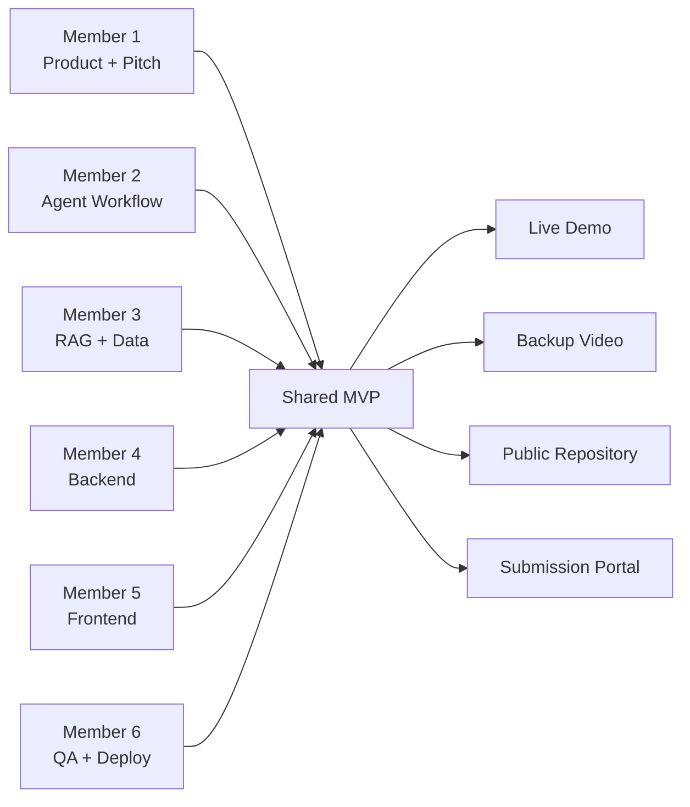
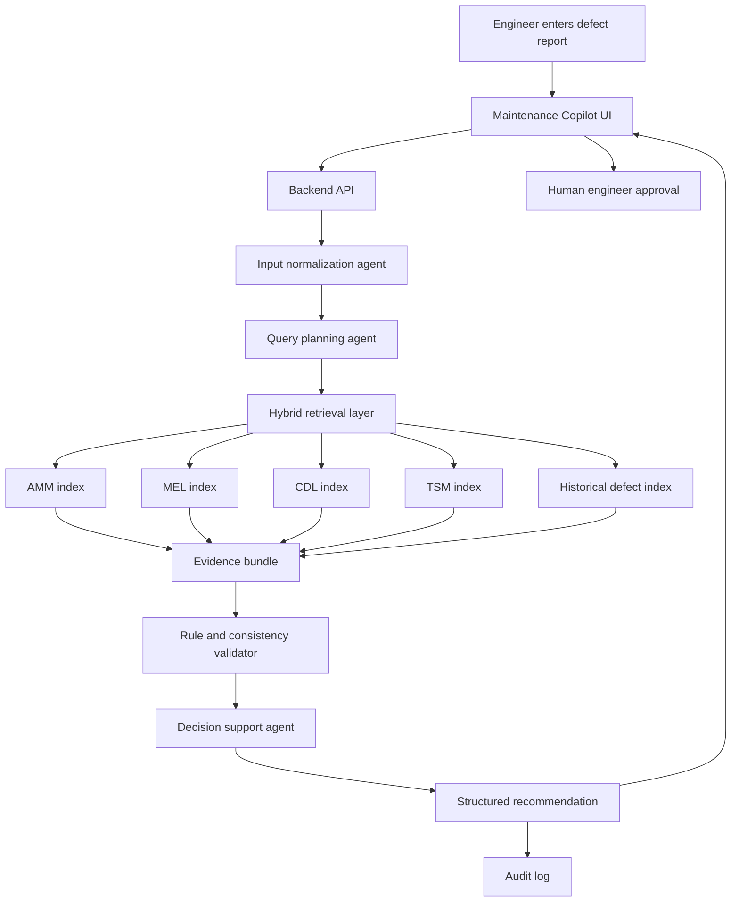
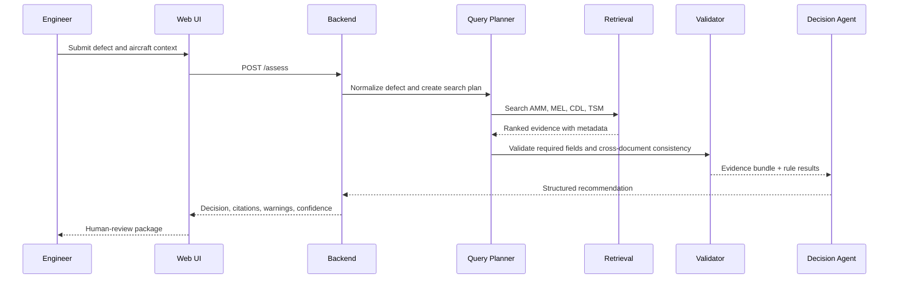
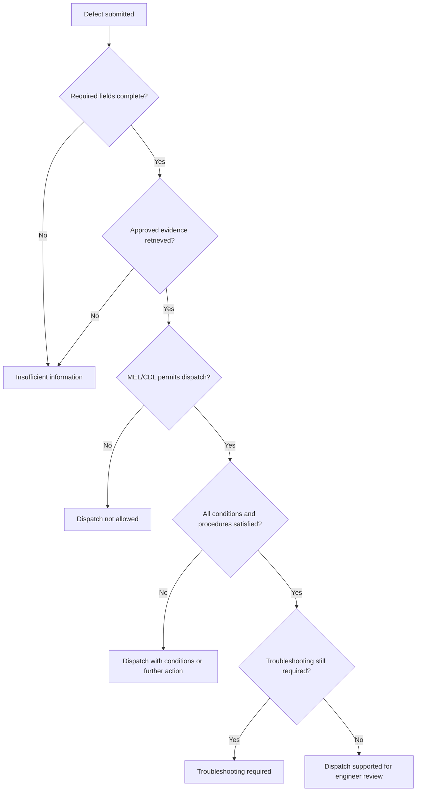
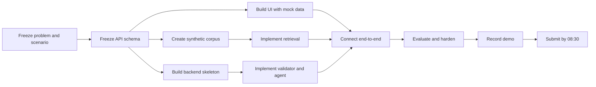

# Aircraft Maintenance Copilot — Hackathon Execution Plan

> **Team size:** 6 people  
> **Build day:** 11 July 2026  
> **Submission deadline:** 09:00, 12 July 2026  
> **Judging begins:** 10:00, 12 July 2026  
> **Primary objective:** Deliver a working, explainable AI maintenance copilot demo that retrieves approved procedures, validates aircraft defect entries, recommends AMM/MEL/CDL/TSM references, and flags inconsistencies with traceable sources.

---

## 1. One-line problem statement

**Aircraft maintenance engineers lose time and face operational risk because defect assessment requires manually searching, cross-checking, and validating fragmented technical documents under high workload.**

## 2. One-line solution

**An AI maintenance copilot that analyzes a defect report, retrieves relevant approved maintenance references, validates the defect and dispatch conditions, flags inconsistencies, and produces an explainable engineer-review package with exact source citations.**

---

# 3. MVP scope

## Must-have

1. Input a defect description and aircraft context.
2. Retrieve relevant passages from synthetic AMM, MEL, CDL, and TSM documents.
3. Classify the likely maintenance path:
   - Troubleshooting required.
   - Dispatch permitted with conditions.
   - Dispatch not permitted.
   - More information required.
4. Recommend exact document references.
5. Flag conflicting or missing information.
6. Show reasoning as structured evidence, not unsupported free-form text.
7. Require a human engineer to approve the final recommendation.
8. Provide a live end-to-end demo.
9. Record a backup demo video.
10. Complete every submission portal field accurately.

## Nice-to-have

- Historical defect similarity search.
- Knowledge graph visualization.
- Engineer feedback capture.
- Confidence scoring.
- Audit trail.
- Multiple-agent orchestration dashboard.

## Explicitly out of scope

- Real maintenance release authorization.
- Automatic aircraft dispatch approval.
- Full OEM document coverage.
- Production-grade access control.
- Direct integration with airline operational systems.
- Claiming regulatory or engineering authority.

---

# 4. Recommended team structure

| Person | Primary role | Core ownership | Backup ownership |
|---|---|---|---|
| Member 1 | Product Lead / Pitch Owner | Scope, judge story, task coordination, submission portal | Demo operator |
| Member 2 | AI / Agent Engineer | Agent orchestration, decision workflow, prompt contracts | Evaluation |
| Member 3 | RAG / Data Engineer | Synthetic manuals, chunking, metadata, retrieval, citations | Knowledge graph |
| Member 4 | Backend Engineer | API, schemas, validation engine, logging | Deployment |
| Member 5 | Frontend Engineer | User interface, evidence panel, workflow UX | Demo recording |
| Member 6 | QA / Evaluation / DevOps | Test cases, evaluation, deployment, README, backup demo | Submission checklist |

## Working rule

Each member owns one deliverable that can be demonstrated independently. No critical component may have only one person who understands it.

---

# 5. Responsibility map



---

# 6. Product architecture



## Core design principle

The LLM must not invent maintenance references. It may only recommend references returned by the retrieval layer and preserved in the evidence bundle.

---

# 7. Agent workflow



## Suggested output schema

```json
{
  "defect_summary": "string",
  "aircraft_context": {
    "aircraft_type": "string",
    "tail_number": "string",
    "ata_chapter": "string"
  },
  "assessment": {
    "status": "dispatch_allowed | dispatch_with_conditions | dispatch_not_allowed | troubleshooting_required | insufficient_information",
    "confidence": 0.0,
    "human_approval_required": true
  },
  "recommended_references": [
    {
      "document_type": "MEL",
      "reference": "MEL 32-XX-XX",
      "revision": "Rev 01",
      "page": 12,
      "excerpt": "string",
      "reason": "string"
    }
  ],
  "inconsistencies": [
    {
      "severity": "high | medium | low",
      "field": "string",
      "message": "string",
      "supporting_reference": "string"
    }
  ],
  "required_actions": ["string"],
  "missing_information": ["string"],
  "reasoning_summary": "string"
}
```

---

# 8. Synthetic data plan

## Minimum document set

Create a small but coherent synthetic corpus instead of many shallow documents.

| Document | Suggested size | Required metadata |
|---|---:|---|
| AMM | 8–12 procedures | document type, ATA, task ID, revision, section, page |
| MEL | 8–12 items | MEL item, category, interval, conditions, procedures |
| CDL | 4–6 items | configuration deviation, penalty, restrictions |
| TSM | 8–12 fault-isolation procedures | symptom, possible causes, test sequence |
| Historical defects | 20–30 records | defect text, aircraft type, resolution, references |

## Recommended scenario

Use one ATA chapter deeply, for example:

- Landing gear indication fault.
- Navigation light inoperative.
- Cabin pressure indication issue.
- Weather radar fault.

Choose one primary scenario for the live demo and two secondary scenarios for robustness testing.

## Required synthetic-data safeguards

- Mark every document as synthetic.
- Give every document a revision number.
- Add section, page, task, and item identifiers.
- Include at least one intentionally conflicting record.
- Include one case with insufficient information.
- Include one case where the correct answer is “dispatch not allowed.”
- Do not use copied proprietary manual text.

---

# 9. Retrieval design

## Chunking

- Chunk by task, item, condition, or troubleshooting step.
- Do not split a MEL condition from its operational or maintenance procedure.
- Preserve headings and hierarchical identifiers.
- Target approximately 400–800 tokens per chunk.
- Add a 50–100 token overlap only where procedures span sections.

## Metadata

```yaml
document_type: MEL
document_id: SYN-MEL-A320
revision: "01"
effective_date: "2026-07-11"
aircraft_type: A320
ata_chapter: "32"
reference_id: "MEL-32-01"
section: "Landing Gear Indication"
page: 12
approval_status: synthetic-approved
```

## Ranking strategy

1. Filter by aircraft type and document status.
2. Retrieve using vector similarity.
3. Add keyword or BM25 matching for exact references and ATA terms.
4. Re-rank top results.
5. Return only the top evidence needed for the decision.
6. Reject a recommendation when no sufficiently relevant approved evidence exists.

---

# 10. Validation logic

The validator should be deterministic wherever possible.

## Example checks

| Check | Implementation |
|---|---|
| Required defect fields missing | Schema validation |
| Aircraft type mismatch | Metadata comparison |
| ATA chapter inconsistent with selected component | Mapping rule |
| Suggested MEL item not present in retrieved evidence | Hard rejection |
| Expired or wrong document revision | Revision check |
| Dispatch interval absent | Warning or insufficient-information status |
| MEL requires an AMM task but no AMM task retrieved | High-severity inconsistency |
| Defect description contradicts selected reference | Semantic and keyword check |
| No source supports the final conclusion | Block final recommendation |

## Decision policy



---

# 11. UI requirements

## Screen 1 — Defect input

- Aircraft type.
- Tail number.
- Flight or operational context.
- Defect description.
- Suspected ATA chapter.
- Existing reference entered by the engineer.
- Submit button.

## Screen 2 — Assessment workspace

- Assessment status.
- Confidence indicator.
- Recommended references.
- Exact evidence excerpts.
- Inconsistency alerts.
- Missing-information questions.
- Required maintenance or operational actions.
- Human approval button.
- “Export review package” button.

## Screen 3 — Audit trail

- Input.
- Retrieved documents.
- Validation checks.
- Final structured output.
- Timestamp.
- Model and tool versions.

## UX rule

The most important visual hierarchy should be:

1. Safety status.
2. Blocking inconsistency.
3. Required action.
4. Supporting source.
5. Model explanation.

---

# 12. API contract

## `POST /assess`

### Request

```json
{
  "aircraft_type": "A320",
  "tail_number": "VN-SYN01",
  "defect_description": "Landing gear green indication is intermittent after gear extension.",
  "suspected_ata": "32",
  "engineer_reference": "MEL 32-01"
}
```

### Response

Use the structured output schema defined earlier.

## Other endpoints

- `GET /documents/{reference_id}`
- `POST /feedback`
- `GET /health`
- `GET /demo-cases`
- `GET /audit/{assessment_id}`

---

# 13. Git workflow

## Branches

- `main`: always demoable.
- `dev`: integration.
- `feature/agent`
- `feature/rag-data`
- `feature/backend`
- `feature/frontend`
- `feature/evaluation-deploy`

## Rules

1. Small pull requests.
2. No direct pushes to `main`.
3. Every merge must preserve the demo path.
4. Use `.env.example`.
5. Commit synthetic documents and test cases.
6. Tag the final version as `hackathon-submission`.
7. Freeze features before final polishing.

---

# 14. Timeline by hour

> The schedule below assumes work continues from the afternoon of 11 July until the 09:00 submission deadline on 12 July.

## Phase 0 — Immediate alignment

### 15:00–15:30, 11 July

| Owner | Deliverable |
|---|---|
| Member 1 | Confirm track, project name, one-line problem, one-line solution |
| All | Agree on one demo scenario and one fallback scenario |
| Member 2–5 | Agree on API and output schema |
| Member 6 | Create master checklist and repository issue board |

**Exit condition:** Everyone can explain the same product in 30 seconds.

---

## Phase 1 — Parallel foundation

### 15:30–18:00

| Member | Tasks |
|---|---|
| 1 | Draft pitch narrative, portal fields, judge criteria mapping |
| 2 | Implement orchestration skeleton and structured-output prompt |
| 3 | Build synthetic corpus, metadata, embeddings, retrieval |
| 4 | Build backend API, schemas, validation stubs |
| 5 | Build input and result UI using mocked JSON |
| 6 | Create evaluation cases, deployment skeleton, README outline |

**Integration checkpoint at 18:00**

- UI can call a mocked endpoint.
- Backend accepts the agreed request schema.
- Retrieval returns sources with metadata.
- Agent returns parseable JSON.
- At least five test cases exist.

---

## Phase 2 — End-to-end MVP

### 18:00–21:00

| Member | Tasks |
|---|---|
| 1 | Prepare screenshots and submission copy draft |
| 2 | Connect agent to retrieved evidence and validation results |
| 3 | Improve retrieval precision, add citation formatting |
| 4 | Connect `/assess`, persistence, and audit logging |
| 5 | Connect real API and implement evidence/inconsistency panels |
| 6 | Run test matrix, log failures, deploy first working version |

**Exit condition by 21:00:** One defect can run from UI input to cited recommendation.

---

## Phase 3 — Safety and explainability

### 21:00–23:30

| Member | Tasks |
|---|---|
| 1 | Refine pitch and prepare judge questions |
| 2 | Add evidence-grounding guardrails and confidence policy |
| 3 | Add conflict and insufficient-information cases |
| 4 | Add deterministic validation rules and error handling |
| 5 | Improve warning hierarchy and audit screen |
| 6 | Perform adversarial tests and regression tests |

**Required tests**

1. Correct reference.
2. Incorrect engineer-entered reference.
3. Missing aircraft context.
4. Conflicting MEL and AMM evidence.
5. No relevant reference.
6. Dispatch-not-allowed case.
7. Prompt-injection text inside a defect description.
8. Retrieval service failure.
9. LLM timeout.
10. Invalid structured output.

---

## Phase 4 — Feature freeze and demo preparation

### 23:30, 11 July–02:00, 12 July

| Member | Tasks |
|---|---|
| 1 | Finalize 3-minute pitch and portal text |
| 2 | Fix only agent-blocking defects |
| 3 | Freeze corpus and document IDs |
| 4 | Stabilize API and add health checks |
| 5 | Polish the golden demo path |
| 6 | Deploy final candidate and record demo takes |

**Feature freeze:** 00:30.

After feature freeze, no new architecture, model, framework, or UI page may be introduced.

---

## Phase 5 — Submission package

### 02:00–05:00

| Member | Tasks |
|---|---|
| 1 | Complete portal draft and partner-tool disclosure |
| 2 | Document models, prompts, and agent responsibilities |
| 3 | Document synthetic data and retrieval approach |
| 4 | Verify setup instructions and API documentation |
| 5 | Capture 3–5 screenshots at 3:2 ratio |
| 6 | Finalize backup video, deployment URL, release tag |

**Exit condition:** A teammate who did not build the system can follow the README and understand the demo.

---

## Phase 6 — Final QA

### 05:00–07:00

Run the full submission checklist twice.

- Test demo URL in incognito mode.
- Test repository access.
- Test video link.
- Test on a second laptop.
- Test with a second network or mobile hotspot.
- Verify every source citation opens or displays correctly.
- Verify no API keys are committed.
- Verify all tools and partners are accurately credited.
- Verify pre-existing assets are disclosed.
- Verify at least one representative is prepared for on-site check-in.

---

## Phase 7 — Buffer and submission

### 07:00–08:30

- Fix only submission-blocking issues.
- Submit no later than 08:30.
- Capture confirmation screenshots.
- Save portal text in the repository.
- Keep the deployed demo untouched after submission unless it is broken.

### 08:30–09:00

- Confirm submission status.
- Confirm on-site representative.
- Prepare offline demo package.

---

# 15. Daily coordination rhythm

## Communication cadence

- 5-minute sync every 90 minutes.
- One shared task board.
- Each person reports:
  1. Completed.
  2. Current blocker.
  3. Next deliverable.
- Blockers older than 20 minutes are escalated.
- Product Lead decides scope cuts immediately.

## Suggested task-board columns

```text
Backlog → Ready → In Progress → Review → Demo Ready → Done
```

## Definition of done

A task is done only when:

- Code is merged.
- Another teammate can run it.
- It is included in the demo path or submission package.
- Failure behavior is acceptable.
- No secret or proprietary content is exposed.

---

# 16. Golden demo scenario

## Scenario

An engineer reports:

> “Landing gear green indication is intermittent after gear extension. The engineer entered MEL 32-01, but did not include the required AMM operational test reference.”

## Demo sequence

1. Enter the defect.
2. Copilot identifies ATA 32.
3. Retrieval returns:
   - Relevant MEL item.
   - Required AMM task.
   - Related TSM fault-isolation task.
4. Validator detects that the engineer-entered record is incomplete.
5. Copilot flags:
   - Missing AMM procedure.
   - Missing operational condition.
   - Need for troubleshooting before final disposition.
6. UI shows exact evidence, revision, page, and reference.
7. Engineer accepts or rejects the recommendation.
8. Audit trail records the decision.

## Why this scenario is strong

- It directly matches the enterprise brief.
- It shows retrieval, validation, recommendation, and explainability.
- It demonstrates value beyond a generic chatbot.
- It has an obvious human-in-the-loop step.
- It creates a clear before-versus-after story.

---

# 17. Three-minute pitch structure

## 0:00–0:20 — Problem

“Aircraft maintenance engineers must manually search and cross-check fragmented technical manuals under time pressure. A missed or incorrect reference can cause delay, inconsistent decisions, or operational risk.”

## 0:20–0:40 — Solution

“Our maintenance copilot turns a defect report into a source-grounded engineer-review package containing the relevant AMM, MEL, CDL, and TSM references, validation warnings, required actions, and an auditable explanation.”

## 0:40–2:10 — Live demo

Show:

1. Defect input.
2. Retrieval.
3. Inconsistency detection.
4. Recommendation.
5. Exact source evidence.
6. Human approval.
7. Audit trail.

## 2:10–2:35 — Architecture

Explain:

- Synthetic approved corpus.
- Hybrid retrieval.
- Deterministic validation.
- LLM decision support.
- Human-in-the-loop.

## 2:35–2:55 — Impact

- Faster manual search.
- Fewer inconsistent references.
- Better traceability.
- Reusable knowledge across the fleet.

## 2:55–3:00 — Closing

“We are not replacing maintenance engineers. We are giving them a faster, safer, and fully traceable review workflow.”

---

# 18. Evaluation plan

## Functional metrics

| Metric | Target |
|---|---:|
| Reference retrieval hit rate on golden test set | ≥ 85% |
| Structured output validity | 100% |
| Unsupported-reference rate | 0% |
| High-severity inconsistency detection | 100% on designed cases |
| End-to-end latency | < 15 seconds |
| Demo completion rate | 5/5 consecutive runs |

## Suggested test-case table

| ID | Case | Expected result |
|---|---|---|
| T01 | Valid defect with matching MEL and AMM | Dispatch with conditions |
| T02 | Wrong engineer-entered MEL item | High-severity inconsistency |
| T03 | Missing aircraft type | Insufficient information |
| T04 | No supporting document | No recommendation |
| T05 | MEL requires AMM task but AMM missing | Block assessment |
| T06 | Dispatch prohibited | Dispatch not allowed |
| T07 | Prompt injection in defect text | Ignore malicious instruction |
| T08 | Conflicting revisions | Flag revision conflict |

---

# 19. Guardrails

1. Every recommendation must cite retrieved evidence.
2. The model cannot create a document ID.
3. Retrieved document metadata must be displayed.
4. The final screen must state “Decision support only — engineer approval required.”
5. Synthetic data must be clearly labeled.
6. Low-confidence cases must request more information.
7. The system must fail closed when evidence is unavailable.
8. Prompt-injection instructions in defect text are treated as untrusted data.
9. Logs must not expose secrets.
10. No claim of regulatory certification.

---

# 20. Risk register

| Risk | Probability | Impact | Mitigation |
|---|---|---|---|
| Enterprise data not delivered | High | High | Use coherent synthetic corpus immediately |
| Retrieval returns irrelevant passages | Medium | High | Metadata filters, hybrid search, small focused corpus |
| LLM hallucinates references | Medium | Critical | Allow only retrieved IDs; validate output |
| Integration delayed | Medium | High | Freeze schemas at start; mock dependencies |
| Deployment fails | Medium | High | Local fallback, recorded demo, second host if available |
| API quota exhausted | Medium | High | Cache demo responses; provide local or backup model |
| UI consumes too much time | Medium | Medium | One polished workflow, no admin dashboard |
| Team builds too many agents | High | High | Limit to 3 logical agents plus deterministic validator |
| Submission fields incomplete | Medium | Critical | Member 1 and Member 6 perform independent checks |
| Demo network is unstable | Medium | Critical | Backup video, offline screenshots, cached scenario |

---

# 21. Scope-cut order

If the team falls behind, cut in this order:

1. Knowledge graph visualization.
2. Historical defect analytics.
3. Multiple aircraft types.
4. Advanced feedback learning.
5. Multiple agent dashboards.
6. Extra document categories.
7. Export feature.

Never cut:

- Source citations.
- Inconsistency validation.
- Human approval.
- Live working path.
- Backup video.
- Submission completeness.

---

# 22. Technology selection principles

Use the stack the team can build fastest.

## Suggested simple stack

- Frontend: Streamlit, Gradio, or Next.js.
- Backend: FastAPI.
- Agent orchestration: direct Python workflow, LangGraph, or equivalent.
- Retrieval: FAISS, Chroma, OpenSearch, or managed vector search.
- Embeddings: available partner or open-source embedding model.
- LLM: reliable model with structured JSON output.
- Deployment: AWS or another stable hackathon-compatible host.
- Observability: structured logs and optional Langfuse/LangSmith.
- Document parsing: PyMuPDF, Unstructured, or partner document intelligence tools.

## Selection rule

Do not adopt a new framework unless it improves a judge-visible capability before feature freeze.

---

# 23. Partner-tool credit log

Maintain this table while building.

| Tool or partner | Exact use | Repository evidence | Portal selected |
|---|---|---|---|
| AWS | Hosting, model inference, vector search, or storage | README architecture section | [ ] |
| LLM provider | Defect analysis and structured recommendation | Source code and environment template | [ ] |
| Embedding model | Technical-document retrieval | Retrieval module | [ ] |
| Document parser | PDF or text ingestion | Ingestion script | [ ] |
| Agent framework | State-machine orchestration | Agent workflow code | [ ] |
| Observability tool | Traces and evaluation | Screenshot or trace link | [ ] |

Only list tools actually used.

---

# 24. Repository checklist

```text
/
├── README.md
├── LICENSE
├── .env.example
├── requirements.txt or pyproject.toml
├── frontend/
├── backend/
├── agents/
├── retrieval/
├── validation/
├── synthetic_data/
├── tests/
├── screenshots/
├── demo/
└── docs/
    ├── architecture.md
    ├── evaluation.md
    └── disclosure.md
```

## README must include

1. Problem.
2. Solution.
3. Architecture.
4. Demo instructions.
5. Local setup.
6. Technology list.
7. Synthetic-data disclosure.
8. Safety and limitations.
9. Team roles.
10. Evaluation results.

---

# 25. Submission portal checklist

## Team setup

- [ ] Team name is final and consistent.
- [ ] All six members are added.
- [ ] Correct track selected.
- [ ] Exact enterprise problem statement selected.

## Project overview

- [ ] Project title is descriptive.
- [ ] One-line problem appears before solution.
- [ ] Elevator pitch is plain language.
- [ ] Description explains enterprise value.
- [ ] Limitations and synthetic-data use are disclosed.

## Links and media

- [ ] Demo URL works in incognito mode.
- [ ] Repository is public or judge-accessible.
- [ ] README contains run instructions.
- [ ] 3–5 readable product screenshots are uploaded.
- [ ] Backup video is 2–3 minutes.
- [ ] Video shows the product, not slides.

## Partner tools

- [ ] Every genuinely used partner tool is selected.
- [ ] Exact usage is described.
- [ ] No unused tool is claimed.
- [ ] Pre-existing code or assets are disclosed.

## Final checks

- [ ] Official rules accepted.
- [ ] Public visibility choice confirmed.
- [ ] On-site representative confirmed.
- [ ] Submission completed before 09:00.
- [ ] Confirmation screenshot saved.

---

# 26. Final acceptance criteria

The project is ready to submit only when all conditions below are true:

- [ ] A judge can understand the problem in one sentence.
- [ ] A judge can complete the live demo without developer intervention.
- [ ] The result contains exact source references.
- [ ] The system detects at least one meaningful inconsistency.
- [ ] The system refuses to answer when evidence is insufficient.
- [ ] The final decision requires engineer approval.
- [ ] Five consecutive golden-demo runs succeed.
- [ ] The repository is accessible and documented.
- [ ] The backup video works.
- [ ] Every portal field is complete.
- [ ] Every technology credit is accurate.
- [ ] At least one team member will check in on-site.

---

# 27. Immediate next actions



## First 30 minutes

1. Assign the six roles.
2. Confirm the golden demo scenario.
3. Freeze request and response schemas.
4. Create the repository and task board.
5. Confirm the track before the portal deadline.
6. Begin synthetic data, UI mock, backend, and pitch work in parallel.

---

## Final team principle

**Build one trustworthy workflow deeply instead of building many shallow features. The winning demo is not the agent with the most tools; it is the system that clearly solves the enterprise brief, works live, cites its evidence, exposes its limitations, and makes the engineer’s decision faster and safer.**
